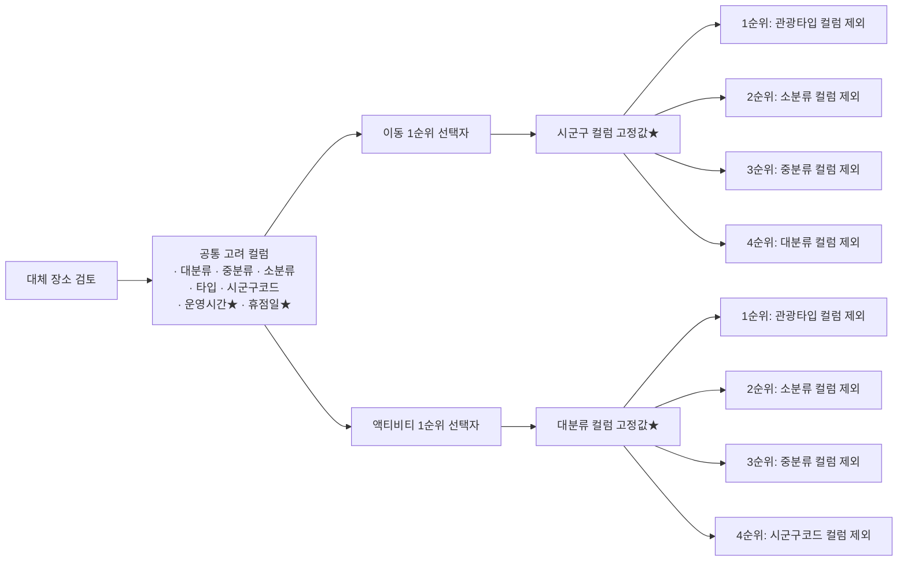

# Activity Team

`[2026-09-28]` **코드 위치가 다시 폴더 안으로 바뀌었다** — 본체는 `app/modules/travel_ops/activity/team.py`, `__init__.py`는 재수출만 한다. 두는 규칙은 [code-layout.md](code-layout.md). `[정정 2026-10-02]` commit `80522d3`으로 `team.py`(778줄 → 278줄)를 책임별 믹스인으로 나눴다 — 성립 판정 `feasibility.py`·취소/변경 `cancellation.py`·날씨 `weather.py`·대체 장소 `replacement.py`. `ActivityTeam`이 상속하므로 import 경로·메서드 이름은 그대로이고 동작도 같다(메서드 22개를 AST로 비교). 아래에 날짜와 함께 적힌 `activity.py`·`activity/__init__.py` 경로·줄 번호는 각각 그때 기록이다.

`[실측 2026-09-10]` **코드가 붙었다** — `app/modules/travel_ops/activity.py` **274줄**, capability 셋(`activity.check_cancelable`·`check_feasible`·`propose_change`), `knowledge_scope` 넷(`activity`·`cancellation`·`refund`·`weather`). 이 문서의 명세와 코드가 어긋나면 **코드를 고친다**(명세가 정본이다). `[정정 2026-09-10]` **「지금 어떻게 돼 있나」의 정본은 코드다** — 명세는 「무엇을 만들려 하나」의 정본이다. 어긋나면 어느 쪽이 틀렸는지부터 가린다. 이 문서도 manifest 절(`accepted_case_types`·`allowed_tools`)을 코드에 맞춰 고쳤다. `[정정 2026-09-24]` **이 경로는 낡았다.** commit `1bc9d51`(`refactor(activity): travel_ops/activity/ 패키지로 분리`)로 `app/modules/travel_ops/activity.py`는 `app/modules/travel_ops/activity/__init__.py`(패키지, 621줄)로 쪼개졌다. 이 문서 안의 `activity.py:NN` 인용을 전부 이 경로·라인 번호로 갱신했다.

근거는 계획서 v11 §5. 여행 도메인 판올림(2026-09-08)으로 생긴 Team이다.

## 왜 이것이 첫째인가

`[실측]` v11 §5. 이유가 둘이다.

| | |
|---|---|
| 판정 규칙을 바로 쓸 수 있다 | **취소·변경 규정이 문서로 존재한다.** 우천 취소 규정 틀을 그대로 판정에 넣을 수 있다 |
| 실패 비용이 크다 | 예약금이 걸려 있다. 틀리면 돈이 날아간다 |

`[실측]` 뼈대는 쇼핑몰 `return_refund` 에서 가져온다 — 취소 기한·위약금율 판정이 구조가 같다.

## 무엇이 이 Team 의 상품인가

★**액티비티는 「여행지에서 하는 활동」 그 자체다.** `[사용자 확정 2026-09-09]`
레저만이 아니다 — **경복궁을 보러 가는 것도 액티비티**다.

| | |
|---|---|
| **다루는 것** | 일정의 **「무엇을 한다」 칸 전부** — 관람 · 체험 · 레저 · 공연 |
| **하는 일** | ① 그 활동의 **정보를 제공한다** ② 일정에서 그 활동이 **성립하는지 판정한다** |
| **예약은 조건이 아니다** | 경복궁은 예약 없이 간다. 그래도 **휴관일·운영시간·날씨**가 걸리므로 판정 대상이다 |

### 범위 — 관광 분류체계로 못박는다

`[팀원 제공 2026-09-10]` 말로 "활동 전반" 이라고만 두면 또 좁혀 읽는다. **외부 분류표에 걸어 둔다.**

★`[정정 2026-09-20]` 아래 A01~A04 표는 한국관광공사 관광정보 API의 **구(舊)분류체계**다. 관광공사가 2023년 개편한 **신분류체계**(대분류 10종)가 지금 근거이고, [팀 스프레드시트](https://docs.google.com/spreadsheets/d/1lCXbot4Ro0BUSnNHp7tVqn5ZXwW0A_xg/edit?gid=1765698897#gid=1765698897)의 `신분류체계정보 관광타입정보 연계 정의서`에서 가져왔다. 구분류 표는 매핑 대조용으로 아래에 남긴다.

| 기준 | Activity 가 맡는 대분류 (구분류, 참고용) |
|---|---|
| **한국관광공사 관광정보 API**<br>(`data.go.kr` 15101578) | **A01 자연** · **A02 인문**(문화/예술/역사) · **A03 레포츠** · **A04 쇼핑** |

### ★ [2026-09-20] 신분류체계 — 지금 근거

`[사용자 제공 2026-09-20]` 신분류체계 대분류 10종 중 Activity 가 맡는 것과 맡지 않는 것.

| 대분류코드 | 대분류명 | Activity 담당 | 왜 |
|---|---|---|---|
| NA | 자연관광 | **담당** | 구분류 A01 자연과 동일 — 산·하천·해양·생태·자연공원 |
| HS | 역사관광 | **담당** | 역사유적지·유물·종교성지·안보관광지. **경복궁이 여기 들어온다**(HS01 역사유적지 · 고궁) |
| VE | 문화관광 | **담당** | 랜드마크·테마공원·도시공원·공연시설·전시시설(박물관·미술관 포함). 구분류 A02 인문의 상당수가 여기로 재편됐다 |
| LS | 레저스포츠 | **담당** | 구분류 A03 레포츠와 동일 — 골프·스키·수상레저·항공레저 |
| EX | 체험관광 | **담당** | 구분류에 없던 축이다. 전통체험·공예체험·농산어촌체험·템플스테이·웰니스관광·산업관광이 여기 명시적으로 잡힌다 |
| EV | 축제·공연·행사 | **담당** | 구분류에 없던 축이다. **공연·뮤지컬이 여기 들어온다**(아래 「걸리는 것」 표의 공연·뮤지컬) — 축제·이벤트·행사가 명시적으로 잡힌다 |
| SH | 쇼핑 | **담당** | 구분류 A04 쇼핑과 동일. ★**대형마트(SH03)가 정식 소분류로 있다** — 아래 「걸리는 것」의 "쇼핑 제외 목록에 대형마트가 있다" 미확보는 이걸로 닫힌다. 신분류체계에서 대형마트는 처음부터 쇼핑 정식 항목이라 제외 목록 자체가 잘못 짜인 것이었다 |

★**`accepted_case_types`·`knowledge_scope`는 아직 구분류 축으로 남아 있다**(아래 manifest 절 참고). 신분류체계로 갈아탈지, 두 축을 병기할지는 정해지지 않았다.

**Google Places API** `place types` 기준(참고용, 아직 유지):

| 갈래 | 유형 |
|---|---|
| 자연 | `beach` · `island` · `lake` · `mountain_peak` · `nature_preserve` · `river` · `scenic_spot` · `woods` |
| 인문·문화 | `historical_place` · `historical_landmark` · `castle` · `monument` · `cultural_landmark` · `tourist_attraction` · `museum` · `art_museum` · `history_museum` · `art_gallery` |
| 쇼핑 | `shopping_mall` · `department_store` · `market` · `flea_market` · `farmers_market` · `gift_shop` · `clothing_store` · `womens_clothing_store` · `jewelry_store` · `shoe_store` · `cosmetics_store` · `toy_store` · `tea_store` · `book_store` · `electronics_store` · `sporting_goods_store` · `sportswear_store` · `liquor_store` |

★`[미확보]` **이 분류는 확정이 아니다.** 쇼핑에서 제외한 **생활밀착형·저관광연관 21종**에
시나리오에 넣은 **대형마트**가 포함돼 있다. **제외 목록을 다시 봐야 한다** — 제외 기준이
"생활밀착"인데 관광객에게는 대형마트가 관광 목적지인 경우가 있다.

| 활동 | 걸리는 감시 소스 | 예약 |
|---|---|---|
| 골프(티타임) | 기상 · 예약 확인 | 필요 |
| 한강 수상 · 겨울 스키·눈썰매 | 기상 · 운영 공지 | 필요 |
| **경복궁 · 박물관 관람** | **운영 공지(휴관일)** · 기상(야외 동선) | **없어도 된다** |
| 공연·뮤지컬 | 취소 공지 | 필요 |
| 쿠킹 클래스 | 운영 공지 | 필요 |
| 테마파크 | 운영 공지 · 기상 | 날짜권 |

★**감시 소스가 활동마다 다른 것은 팀을 쪼갤 이유가 아니다.** 항목마다 **해당하는
소스만** 본다 — 실내 공연에 기상을 걸지 않고, 무료 관람에 위약금을 걸지 않는다.
Team 이 셋을 다 알고 있고 **항목이 어느 것에 걸리는지를 판정**한다.

### 활동의 범위 — 확정

`[사용자 확정 2026-09-09]` Activity는 **활동 그 자체**다. 레저로 좁히지 않는다. 경복궁 관람도 포함된다.

`[결정 2026-09-10]` v11 §5-D — Activity가 판정하고 새 업무 규칙을 만들지 않는다. 판정 입력은 「예약」이 아니라 「일정 항목」이다.

`[실측 2026-09-10]` 코드는 아직 이 결정을 따라가지 못했다 — 예약이 없으면 「모름」으로 끝난다(`activity/__init__.py:109~116`).

## 셋을 갖는다

모든 여행 Team이 같은 셋을 갖는다(v11 §5). Activity의 값은 이렇다.

### ① 검증 규칙 — 코드가 판정한다

| 무엇 | 판정 |
|---|---|
| 예약 시간 | 앞뒤 일정과 겹치는가. 이동 시간을 빼고도 남는가 |
| 운영일 | 그날 문을 여는가. 휴무·시즌 종료인가 |
| 인원 | 예약 인원과 일행 수가 맞는가. 최소 인원 미달인가 |
| 날씨 조건 | 우천·강풍 취소 조건에 걸리는가 |
| 취소/환급 규정 | 지금 취소하면 얼마가 돌아오는가. 무료 취소 구간이 언제 끝나는가 |

**LLM을 부르지 않는다.** v11 §4-D — 계산으로 판정 가능한 것은 코드가 한다.

`[실측 2026-09-20]` **입력 JSON의 필수값이 빠졌을 때 동작이 정식 테스트로 고정됐다** — `tests/unit/travel/test_activity_input_validation.py`(8건).

| 없는 값 | 결과 |
|---|---|
| `booking`(일정) 자체 | escalate, `unknown_예약 내역` |
| `starts_at`(시각) 누락·타입 오류 | escalate, `unknown_예약 시각` |
| `policy`(규정) | escalate, `unknown_취소·환급 규정` |
| `place`(장소) — `None` | **escalate 안 함.** `feasible: True` 유지, `place_confirmed: False`로만 표시하고 계속 진행 |
| `party_size`·`capacity` | 정원 초과 검사만 건너뛰고 계속 진행 |

★`[정정 2026-10-02]` commit `048f3cc` — **`check_feasible`에 한해** 위 표의 두 줄이 바뀌었다. 취소·변경(`check_cancelable`·`propose_change`)은 그대로 escalate로 멈춘다. 테스트 기대값도 맞춰 고쳤다(`test_activity_input_validation.py`, 지금 20건).

| 없는 값 | `check_feasible`의 지금 결과 |
|---|---|
| `policy`(규정) | **막지 않는다** — 성립 판정은 취소·환급 규정을 쓰지 않는다 |
| `starts_at`(시각) | escalate 대신 `feasible: False` · `status: "insufficient_info"` · `reason: "time_unknown"`(RESPOND). 휴무·운영시간·재난·기상을 잴 수 없으니 「모름」을 「성립」으로 읽지 않고, 대체 장소도 찾지 않는다 |

정원 초과는 시각을 몰라도 확인되므로 `insufficient_info`보다 **먼저** `problem`으로 나간다.

★**경계 케이스 하나를 있는 그대로 고정해 뒀다** — `place`가 `None`이 아니라 **빈 dict `{}`**면 `place_confirmed: True`로 찍힌다(`place is not None`만 보는 코드라서). 필드가 하나도 없어도 "확인됨"으로 잡히는 셈이다. 옳고 그름을 판정하지 않고 **지금 이렇게 동작한다**는 사실만 테스트로 남겼다 — 스키마를 더 엄격히 검사할지는 별도 결정이다.

### `weather_sensitive` — DB가 모르면 장소명으로 추정한다

★★★`[구현 2026-09-20]` **실 데이터에서 이 컬럼은 영원히 `NULL`이다.** TourAPI가 실내/실외 필드를 안 주고(어떤 응답에도 그런 필드가 없다), `places`에 실제로 값을 쓰는 프로덕션 경로 자체가 없다(`scripts/seed_travel.py` 말고는 `INSERT INTO places`가 저장소 어디에도 없다 — 2026-09-20 실측). 사용자가 이걸 확인하고 "title 기준으로 실내·실외 판별 알고리즘을 새로 작성"하라고 결정했다.

`ActivityTeam._weather_sensitive_from_title(name)` — DB 값이 `None`일 때만 불린다. DB에 이미 값이 있으면(`True`/`False`) 이름은 아예 안 본다.

| 갈래 | 키워드 |
|---|---|
| 실외(`True`) | "옥상"·"광장"·"공원"·"거리"·"운동장" |
| 실내(`False`) | "층"(정규식 `\d+층`/`\d+F`/`B\d+`)·"홀"·"실내"·"전시실" |
| 모름(`None`) | 단서 없음, 또는 양쪽 다 걸림(예: "○○공원 전시홀") — **억지로 고르지 않는다** |

★**추정했다는 사실을 숨기지 않는다.** DB 확정값이 아니라 이름으로 추정해서 기상을 조회했으면 근거(`activity.weather_sensitive_from_title`)와 경고("실내·실외를 장소명으로 추정해 날씨를 조회했다 — DB에 확인된 값이 아니다")를 반드시 남기고, `decisions.weather.weather_sensitive_guessed_from_title`에 `true`를 찍는다.

`[실측 2026-09-20]` **정식 테스트** — `tests/unit/travel/test_activity_weather_sensitive_guess.py`(17건): 사용자가 준 키워드 예시 전부(parametrize), 상충 케이스, DB 확정값이 있으면 이름을 안 보는지, DB가 모를 때만 추정하고 그 사실을 공개하는지, 단서가 없으면(`경복궁`) DB가 몰라도 억지로 기상을 안 부르는지.

### ② 감시 소스

| 소스 | 무엇을 본다 | 상태 |
|---|---|---|
| 운영 공지 | 휴무·시간 변경·시즌 종료 | **닫힘 — `[확정 2026-09-20]`** `Activity_모듈_스펙.md`가 출처를 **TourAPI**(운영 여부)·**재난문자API**(재난상황)로 확정했다. 소스·조회 시점·재검토 주기까지 정해졌다 → [TourAPI·재난문자API 연동](#tourapi--재난문자api-연동-확정) |
| 기상청 초단기예보 | 우천·강풍 | `[정정 2026-09-20]` `Activity_모듈_스펙.md`가 **날씨 조회를 현재 구현 범위에서 뺐다.** 9절(추후 확장)로 이동 — 지금 `check_feasible` 판정 순서엔 없다. `knowledge_scope`의 `weather`는 아직 이 정정을 안 반영했다(manifest 절 참고) |
| 예약 확인 | 예약이 아직 유효한가 | Mock 허용 |

★**②가 이 Team의 가장 큰 미확보였다.** 판정 규칙은 규정 문서로 만들 수 있지만, "오늘 그 업체가 쉰다"를 아는 경로가 없으면 감시가 성립하지 않았다 — TourAPI·재난문자API 확정으로 경로 자체는 생겼다. 남은 건 세부 사양(§ 아래 미정 항목들)이다.


### ★ [2026-09-10] 감시 소스는 넓은 것부터 좁은 것으로

`[결정 2026-09-10]` v11 §7-C — **업체를 먼저 뚫지 않는다.** 어느 장소에나 통하는 공개 소스에서 시작해 덮이는 범위를 넓혀 간다.

| 단계 | 무엇을 본다 | 덮는 범위 | 상태 |
|---|---|---|---|
| **1** | **공개 API** — 기상 · 관광정보(운영시간·휴무) · 장소 · 이동 | 서울의 거의 모든 항목 | **이미 쓴다** |
| **2** | **공개 사이트·공지** — 개별 시설의 휴관·운영 변경 | 표본을 뽑아 늘린다 | 도시가 정해져 **시작할 수 있다** |
| **3** | **업체 정보** — 공급자가 주는 변경 | 협약한 곳만 | **MVP 밖** |

★**1단계만으로 루프가 증명된다.** 대표 시연이 기상 하나로 돈다 — **2단계가 없다고 시연이 막히지 않는다.** 다만 "실제 운영 변경을 잡는다"는 주장은 2단계까지 가야 선다.

★**커버리지를 세어서 말한다.** "공지를 수집한다"가 아니라 **서울 표본 N곳 중 몇 곳이 어느 단계로 덮이나**를 적는다. **분모를 안 밝히면 커버리지가 아니다.**

★**못 덮는 것은 Mock 으로 증명하고 그렇게 표시한다.** Mock 이벤트로 돈 루프를 "실제 운영 변경을 감지했다"로 말하지 않는다.

`[미확보]` 2단계의 대상 목록과 수집 방식은 표본 조사 결과로 정한다.

### ③ 재계획 후보

| 후보 | 언제 |
|---|---|
| 같은 시간대 대체 | 같은 종류의 다른 액티비티가 그 시간에 가능할 때 |
| 날짜 이동 | 같은 액티비티를 다른 날로 옮길 수 있을 때 |
| 환급 안내 | 대체가 없고 취소가 유리할 때 |

**후보 생성은 LLM이 하고, 생성한 후보는 ①을 다시 통과해야 통지된다**(v11 §5). 판정을 건너뛴 대안은 나가지 않는다.

### 대안 생성 규칙 — `[사용자 제공 2026-09-24]`

★LLM이 후보를 **얼마나 넓게 뿌릴지가 아니라 어떻게 좁힐지**의 규칙이다. 아직 코드에 없다 — 위 "후보 생성은 LLM, ①이 다시 통과시킨다"는 v11 §5 원칙 아래, **필터링 단계**의 구체적 기준만 여기 못박는다. 세 필드(`contenttypeid`·`lclsSystm1/2/3`·`sigungucode`) 모두 TourAPI 원본 필드이고, `scripts/activities_candidates_seoul_enriched.csv`(위 [manifest·데이터 저장 절](#현재-장소-변경-감지-가능한-목록-확장-예정) 참고)에 이미 컬럼으로 있다.

| 단계 | 기준 | 무엇을 거르나 |
|---|---|---|
| ① 대안 가능 여부 | `business_hours`(운영시간) · `closed_days`(휴무일) | 그 시간대에 실제로 열려 있는 장소만 남긴다 |
| ② 대안 유사도 | `contenttypeid` · `lclsSystm1` · `lclsSystm2` · `lclsSystm3` · `sigungucode` | 기존 일정과 **같은 갈래**(관광타입·신분류체계 대/중/소분류·시군구)의 장소만 남긴다 |
| ③ 선호도 반영(설문 추가 예정) | 이동/활동 중요도에 따라 ②의 필드 우선순위를 바꾼다 | 아래 우선순위표 |
| ④ 순위 산출 | ①②③ 통과 후보가 여럿이면 유사도 점수로 1·2·3위를 뽑는다 | [대안 순위 산출](#대안-순위-산출--제안-2026-09-24-미확보) 절 |

③의 우선순위(왼쪽이 높다):

| 중요도 타입 | 우선순위 |
|---|---|
| 이동 중요 | `sigungucode` > `lclsSystm1` > `lclsSystm2` > `lclsSystm3` > `contenttypeid` |
| 활동 중요 | `lclsSystm1` > `sigungucode` > `lclsSystm2` > `lclsSystm3` > `contenttypeid` |

★`[정정 2026-10-02]` 위 표·아래 다이어그램의 `sigungucode`(시군구) 자리는 **반경(km)**으로 바뀌었다 — 이동 중요는 「가까운 반경 고정」, 활동 중요는 「같은 분류에서 반경을 먼저 넓힘」. 지금 규칙의 정본은 [반경·노출 규칙](#대체-장소-반경노출-규칙-구현-2026-10-02)이다.

★`[정정 2026-09-24 추가]` `contenttypeid`가 ②단계(대안 유사도)의 5개 필드 중 하나인데도 원래 우선순위표엔 빠져 있었다. **최하위(5번째)로 추가한다** — 신분류체계 연계 정의서 대조 결과, `contenttypeid`는 `lclsSystm1`보다 거친(coarse) 구분류다. 예: 역사관광(HS)·체험관광(EX)이라는 서로 다른 대분류가 `contenttypeid`에서는 똑같이 "12 관광지"로 묶인다(AC05 캠핑처럼 같은 대분류 안에서도 소분류에 따라 값이 갈리는 예외도 있어 일관성도 낮다). `lclsSystm1~3`이 이미 더 세밀하게 갈라주므로 `contenttypeid`는 추가 판별력이 거의 없고, 아래 "폴백" 규칙에도 **가장 먼저 빠지는 게 합리적이다.**

`[팀원 제공 2026-09-24, 다이어그램]` 우선순위 결정 흐름을 도식화하면 아래와 같다. 이동 1순위·액티비티 1순위 각각 **고정값(항상 유지되는 필드)**을 먼저 못박고, 그다음 어떤 필드부터 제외할지를 순서로 정한다.



**폴백**: ②(또는 ③ 반영 후)의 유형 필터링 결과가 **0건**이면, 우선순위가 **가장 낮은 필드부터 하나씩 제거**하며 다시 필터링한다. `[정정 2026-09-24]` 위 우선순위표 기준으로는 `contenttypeid`가 최하위이므로 **가장 먼저** 빠진다 — 예: 활동 중요 타입에서 0건이면 `contenttypeid`를 먼저 빼고 재시도, 그래도 0건이면 `lclsSystm3`을, 그래도 0건이면 `lclsSystm2`까지 뺀다.

★`[정정 2026-10-01, 팀 합의]` **위 폴백 순서(타입이 가장 먼저 빠진다)는 낡았다.** 지금 코드(`alternatives.py`의 `FALLBACK_DROPS`)는 `contenttypeid`를 **대분류와 한 묶음**으로 본다(관광타입 38=쇼핑, 15=행사, 14=문화시설처럼 대분류와 거의 1:1이라 따로 풀 이유가 없다). 풀어야 한다면 대분류와 함께 맨 마지막에 푼다.

| 선호도 | 고정 | 0건이면 앞에서부터 한 단계씩 뺀다 |
|---|---|---|
| 이동 중요 | 시군구 | ① 소분류 → ② 중분류 → ③ 대분류+타입 |
| 활동 중요 | 대분류+타입 | ① 소분류 → ② 중분류 → ③ 시군구 |

★`[정정 2026-10-02]` **시군구를 빼고 반경(km)으로 바꿨다** → [반경·노출 규칙](#대체-장소-반경노출-규칙-구현-2026-10-02). 시군구로 재면 같은 구의 먼 곳이 옆 구의 가까운 곳보다 앞서고(경계 문제), 구마다 넓이가 달라 넓히는 기준이 일정하지 않다.

### 대안 순위 산출 — `[제안 2026-09-24, 미확보]`

★`[정정 2026-09-24]` **이 절은 "## 셋을 갖는다"의 넷째 항목이 아니다.** 위 [대안 생성 규칙](#대안-생성-규칙--사용자-제공-2026-09-24) 표의 ④단계를 풀어 쓴 것뿐이고, "대안 생성 규칙" 전체가 [③ 재계획 후보](#-재계획-후보)의 하위 절차다. v11 §5가 모든 여행 Team에 못박은 "셋"(검증 규칙·감시 소스·재계획 후보)은 그대로다.

①②③을 통과한 후보가 **여럿**이면, 유사도 점수로 1·2·3위를 뽑는다. ①②③이 범주형 일치(같은 분류인가 아닌가)만 판정하는 것과 달리, 이 순위 산출은 **연속값 비교**로 순서를 매긴다.

| 신호 | 출처 | 확보 상태 |
|---|---|---|
| 좌표 거리 | `tour.mapx`/`mapy` | **바로 가능** |
| 평점·리뷰 수 | Google Places API(`rating`, `userRatingCount`) | 미확보 — 별도 호출 필요 |
| 영업시간 여유도 | `restdate_text`/`usetime_text`(원문) | `[사용자 확정 2026-09-24]` **파싱 필요함이 확정** — 구현은 아직 없음 |
| 가격대 유사성 | Google Places API(`priceLevel`) | 미확보 |

**1차 구현(확정하기 쉬운 범위):** 좌표 거리만으로 오름차순 정렬해 1·2·3위 출력.

★`[정정 2026-10-02]` 지금은 거리만이 아니다 — 영업 확인 → 반경 1km 안 같은 브랜드 → (이동 중요) 거리·분류 가까움 / (그 밖) 분류 가까움·거리 순이고, 같은 브랜드 체인은 1곳만, 화면 3곳 + 「더보기」 10곳까지다 → [반경·노출 규칙](#대체-장소-반경노출-규칙-구현-2026-10-02).

★`[구현 2026-09-26]` **1차 구현이 코드로 들어갔다** — `app/modules/travel_ops/activity/alternatives.py`의 `rank_alternatives()`. 좌표 직선거리(haversine) 오름차순이고, 확장안(가중합)은 아직 없다. 상세는 [구현 현황 — 작업자 B](#구현-현황--작업자-b-구현-2026-09-26) 참고.

```
1. ①②③ 통과 후보 목록
2. 각 후보 ↔ (원래 장소 또는 그날 다음 일정) 직선거리 계산
3. 거리 오름차순 정렬 → 1·2·3위
```

**확장안:** 여러 신호를 가중합으로 묶은 점수.

```
유사도 점수 = w1 × (1/거리) + w2 × 평점 + w3 × 영업시간_여유도 + w4 × 가격대_유사도
```

★`[미확보 2026-09-24]` `w2`(평점)·`w4`(가격대)는 Google Places API 추가 호출이 선행되어야 계산 가능 — 6절 요금제 문서의 비용 이슈와 연결됨. 가중치를 189행의 "이동 중요/활동 중요" 선호도와 연결할지, 동점 처리를 어떤 필드로 할지도 미정.

★`[사용자 제공 2026-09-24]` **선호도가 `null`이면 ③(우선순위 판정)을 아예 고려하지 않는다.** 설문에 응답하지 않은 경우 이동/활동 중요도를 임의로 가정하지 않는다 — ②까지만 적용하고 필드 순서를 매기지 않은 채로(동순위) 넘긴다. 폴백(0건일 때 후순위 필드 제거)도 이 경우 "가장 낮은 우선순위"가 없으므로 적용하지 않는다.

★`[미확보 2026-09-24]` **①의 두 필드는 아직 판정 가능한 자리에 없다.** `place_catalog`는 지금 `business_hours`·`closed_days`를 구조화 컬럼이 아니라 `raw_json`에만 담는다(`scripts/load_place_catalog_csv.py:62~64` — CSV의 보강 컬럼은 `raw`로 들어갈 뿐 별도 컬럼이 아니다). 판정 경로가 실제로 쓰는 것은 [휴무 요일 대조](#휴무-요일-대조--유일한-예외)의 `restdate_text`(자연어 원문, `places` 테이블)다. `business_hours`/`closed_days`가 이 `restdate_text`/`usetime_text`와 같은 원본을 가리키는 이름인지, 아니면 카탈로그에 별도로 승격해야 하는 필드인지는 안 정해졌다.

★`[미확보 2026-09-24]` `sigungucode`도 지금 `place_catalog`엔 안 실린다(`to_row()`가 `area_code`를 서울 고정값 `"1"`로만 넣는다 — 시군구 단위는 없다). 유사도·우선순위 판정에 쓰려면 `place_catalog`에 컬럼을 추가하거나 `raw_json`에서 읽어야 한다. `[닫힘 2026-10-02]` 판정에 더는 시군구를 쓰지 않는다(반경으로 교체) — 이 미확보는 필요 없어졌다.

★**②·③은 후보 생성 이후의 필터이지 ①(판정)을 대신하지 않는다.** 유사도로 골라낸 후보도 통지 전에 [①검증 규칙](#-검증-규칙--코드가-판정한다)을 다시 통과해야 한다 — 위 원칙 그대로다.

`[실측 2026-09-10 작업 트리]` **LLM 후보 생성은 아직 없다.** `_propose_change()`(`activity/__init__.py:497`)는 대안을 만들지 않는다 — 받은 예약에 `activity.change` 제안 하나(`booking_id`·`reason`)를 만들어 승인 대기에 올린다. 그래서 무예약 활동은 이 경로로도 제안을 못 만든다(아래 대조 표 절과 같은 문제).

★`[실측 2026-09-20]` `Activity_모듈_스펙.md` §3-3 — 더 근본적인 문제가 하나 더 있다. **분류 경로가 `activity.propose_change`에 아예 도달하지 못한다.** 분류된 intent(`itinerary_submit` 등)가 이 Team의 capability 네임스페이스와 매칭되지 않아서, 지금 분류 경로는 항상 기본 capability(`activity.check_feasible`)만 고른다(`registry.py:115~119`). LLM 후보 생성이 없는 것과는 별개로, **애초에 변경 제안 경로 자체가 선택되지 않는다.** `[정정 2026-09-20]` **`itinerary_submit` 쪽은 아래 절에서 닫혔다** — `propose_change`(기존 예약 변경)와는 다른 별도 capability(`submit_itinerary`, 신규 일정)로 받기로 했다. `propose_change` 자체의 라우팅 미도달은 아직 안 고쳤다.

## 일정 제출 — 예약 없이 시작하는 capability

★★★`[구현 2026-09-20]` **`itinerary_submit`이 100% escalate 되던 문제를 고쳤다.** 사용자가 "뭐부터 해야 돼?"로 순서를 물어서 설계→구현까지 이어졌다.

### 실측 — 고치기 전엔 무슨 일이 있었나

고객이 "화요일에 경복궁 갈 거야"라고 하면: 분류기가 `intent="itinerary_submit"`·`issue_code="activity_*"`를 뽑고 → `issue_code` 접두로 ActivityTeam까지는 라우팅되는데 → `capability_for()`가 `intent`를 이름으로 못 맞춰서(`activity.*` 네임스페이스와 `itinerary_submit`이 안 겹침) 항상 `default_capability="activity.check_feasible"`을 고르고 → `check_feasible`이 `read.booking`부터 불러 **당연히 없는 예약**을 찾다가 → `unknown_예약 내역`으로 **무조건 escalate**됐다. `wiki/teams/Activity_모듈_스펙.md`(삭제됨, 2026-09-20)가 처음 지적한 문제의 실제 재현 경로다.

### 결정 — Phase 1 범위로 좁힌다

`[결정 2026-09-20]` 이 시스템 전체(`activity.change` 포함 **모든** action type)가 "승인해도 실제로 실행하는 코드가 없다"는 걸 확인했다 — `scripts/run_outbox_worker.py`의 `publish()`가 `"Transport is intentionally an injected boundary in Phase 1"`이라고 명시한 no-op 스텁이다. `/v1/cases/{id}/actions/{id}/approve`도 Case 상태만 `approved`로 바꿀 뿐, `action_type`별 실행기는 어디에도 없다. **그래서 일정 제출도 같은 성숙도에 맞춘다 — `ActionProposal`까지만 만들고, 실제 `activities`/`places` INSERT는 만들지 않는다.** 더 넓게(이 흐름만 실제로 쓰게) 갈지는 사용자가 명시적으로 거절했다 — Activity 하나의 문제가 아니라 시스템 전체의 실행 계층이 필요한 일이라서다.

### 구현

- **manifest**: `capabilities`에 `activity.submit_itinerary` 추가. `allowed_tools`에 `read.place_search` 추가
- **라우팅**: `ActivityTeam.select_capability(intent, input_text)` 신설(`registry.py:105~114`의 기존 훅 — `mobility.py`가 선례) — `intent == "itinerary_submit"`이면 이 capability를 고른다. **코어(`registry.py`)는 한 줄도 안 고쳤다**
- **`execute()` 분기**: 이 capability만 `read.booking`을 부르기 **전에** 갈린다(`activity/__init__.py` `execute()` 상단, 84~97행) — 나머지 셋은 예약이 있다고 전제하는 공통 경로를 그대로 탄다
- **`read.place_search`(신규 도구, `read_tools.py`)**: `place()`(이미 아는 `place_id`로 우리 DB 조회)와 다르다 — **아직 모르는** 장소를 이름으로 TourAPI에서 찾는다. `tour_api.py.find()`를 그대로 감싼다. 정확일치 1건이 아니면(동명이인 등) 확정하지 않고 `None`(013이 겪은 문제 재발 방지)
- **`_submit_itinerary()`**: `current_state`에서 `requested_place_name`·`requested_activity_time`을 읽는다(고객 문장을 이 Team이 직접 파싱하지 않는다 — 그건 분류·추출 계층의 몫). 장소를 찾으면 `activity.submit`(`risk="low"`, `activity.change`의 기본값 `high`보다 낮다 — 고객 자기 입력이라 위험도가 낮다는 판단) 제안을 만들어 `WAIT_FOR_APPROVAL`. 못 찾으면(애매함 포함) **사람에게 escalate하지 않고** `WAIT_FOR_INPUT`으로 고객에게 되묻는다 — 계약에 선언만 되고 아무도 안 쓰던 `required_input_schema`의 **첫 실사용 사례**

★**회귀로 걸린 것 하나**: 장소를 못 찾으면 `read.place_search`가 `None`을 줘서 `_evidence()`가 근거를 안 쌓는데, `WAIT_FOR_INPUT`은 `answer`가 있으면 근거가 최소 1건 있어야 한다(계약 검증). 고객이 실제로 제출한 값(`requested_place_name`·`requested_activity_time`) 자체를 `case.current_state` 근거로 남겨서 해결 — "검색이 실패했다고 근거까지 사라지면 안 된다."

`[실측 2026-09-20]` **정식 테스트** — `tests/unit/travel/test_activity_submit_itinerary.py`(11건): 라우팅 훅 3건, `read.booking` 미호출 회귀 가드 1건, 필수값 누락 3건, 정상 제안 2건, 장소 미매칭 2건(위 근거 회귀 가드 포함).

### 장소 이름 조회 — `read.place_lookup` `[구현 2026-10-02]`

★`[정정 2026-10-02]` commit `048f3cc` — **위 `read.place_search`는 일정 제출에서 더 쓰지 않는다.** `allowed_tools`와 `_submit_itinerary()`가 `read.place_lookup`으로 바뀌었다(`read.place_search` 도구 자체는 `ReadToolbox`에 남아 있다). `place_search`는 못 찾으면 `None` 하나라서 「없음」과 「못 물어봄」을 가르지 못했다.

본체는 `activity/place_lookup.py`의 `lookup_place()`, 도구는 `read_tools.py`의 `place_lookup()`이다.

```
① place_catalog 이름 조회 (db_search/place_by_name.py)
     found · ambiguous → 그대로
     not_found         → ②
② 카카오 키워드 검색 — 실재하는지만 본다
     이름이 맞는 곳 있음        → exists_unregistered
     맞는 이름 없음             → not_found
     못 물음(키 없음·예산·시간 초과) → unknown   ← 「없음」이 아니다
```

| `status` | `_submit_itinerary()`의 처리 | 실패 코드 |
|---|---|---|
| `found` | `activity.submit` 제안 → `WAIT_FOR_APPROVAL` | — |
| `ambiguous` | 후보 이름(최대 몇 곳)과 개수를 보여 주고 고객에게 고르게 한다(`WAIT_FOR_INPUT`) | `place_ambiguous` |
| `exists_unregistered` | 실재하지만 지원 목록에 없어 일정을 만들지 않고 되묻는다(`WAIT_FOR_INPUT`) | `place_exists_unregistered` |
| `not_found` | 더 정확한 이름을 되묻는다(`WAIT_FOR_INPUT`) | `place_not_found` |
| `unknown` | **고객에게 되묻지 않고 사람에게 넘긴다**(`_unknown()` escalate) | `place_lookup_blocked` |

★★**카카오 응답은 어디에도 저장하지 않는다**(카카오 운영정책 제5조). 결과는 Case 근거로 저장되므로 카카오가 준 이름·좌표·주소·id를 싣지 않고 「있다/없다/못 물었다」 판정만 싣는다. 그래서 실재해도 카탈로그에 없는 곳은 일정 제안을 만들 수 없다. 없는 곳을 DB에 올리는 방법은 아직 정하지 않았다.

★이름 일치는 `intake.places._kakao_match`와 같은 규칙이다 — 같은 이름이거나 질의로 시작하는 이름이 **하나뿐**일 때만 「있다」. 카카오 1위가 아무 가게여도 「있다」고 하지 않는다. 카탈로그 조회는 공백·기호를 뺀 이름으로 비교하고, 2글자 미만이면 카카오까지 가지 않고 `not_found`(`name_too_short`)다.

공용 파일 변경: `read_tools.py`에 `kakao` 필드와 도구 추가, `composition.py`에서 카카오 클라이언트 생성을 분리해 `ReadToolbox`에 주입. 시험 `tests/unit/travel/test_activity_place_lookup.py`(16건) + `tests/integration/db/test_place_by_name_db.py`(8건, 실 PostgreSQL).

## TourAPI · 재난문자API 연동 (확정)

`[확정 2026-09-20]` `Activity_모듈_스펙.md` — `check_feasible` 판정 순서에 신규 조회 둘이 들어간다. 날씨 조회는 여기 없다(위 ②감시 소스 표 참고 — 현재 구현 범위 아님, 9절로 이동).

### 판정 순서

1. **정원 확인** — 정원 초과 시 즉시 `feasible: False`로 RESPOND (`activity/__init__.py:172~179`)
2. **장소 확인(TourAPI 조회)** — 운영시간·휴무 **원문** 확인. `[구현 2026-09-20]` 아래 참고
3. **재난문자API 조회** — 재난상황 없는지 감지. **세부 사양 미정**

> `[미확보]` 이 순서(정원→TourAPI→재난문자)가 판정 로직상 타당한지는 세부 설계 시 재검토가 필요하다고 스펙 문서 자체가 표시하고 있다.

★★`[정정 2026-09-20, 재정정]` 앞서 이 절은 "TourAPI 클라이언트가 `scripts/seed_travel.py`와 테스트에서만 쓰인다"고 적었다 — **이것도 부정확했다.** `app/infrastructure/travel/base.py`의 `build_travel_sources()`가 이미 `sources.place = TourApiPlace(...)`로 조립하고 있었고, `composition.py:160~163`이 그걸 `ReadToolbox(travel=...)`에 실제로 주입한다. **빠진 건 클라이언트도 배선 진입점도 아니라, `ReadToolbox.place()`(=`read.place` 도구)가 그 `self.travel.place`를 안 쓰고 있었다는 것 하나였다.**

**`[구현 2026-09-20]` 그 한 곳을 이었다.** `app/tools/read_tools.py`의 `place()`가 이제 `places.source_content_id`/`source_content_type_id`(013으로 해소된 신원)가 있으면 `self.travel.place.operating(content_id, content_type_id)`를 불러 `place["operating"]`에 담는다(`_fill_operating()`). `activity/__init__.py:160`의 `_check_feasible()`이 이 값을 근거(`read.place.operating`)와 안내 문구(`_operating_note()`)로 쓴다. `tour_api.py`의 `operating()`이 애초에 `usetime_text`·`restdate_text`를 자연어 원문으로만 주고 `answers_open_at_slot: False`로 명시한다(파싱하면 "화요일 휴무, 단 공휴일과 겹치면 개방" 같은 예외 조건에서 하나 틀려도 고객이 문 닫힌 곳 앞에 선다). `read.weather`가 강수확률·풍속을 판정에 안 쓰는 것과 같은 원칙이다.

새 도구 이름을 안 만들었다 — `allowed_tools`(`read.place`)·budget 변경이 필요 없다.

라이브 DB에 `place()`의 새 SQL을 직접 실행해 스키마와 맞음을 확인했고, 가짜 TourAPI 소스로 `_fill_operating()`·`_operating_note()` 경로를 확인했다. 기존 테스트 304개는 그대로 통과(무관한 사전 실패 3건은 이 DB에 prompt 미등록 때문).

### 휴무 요일 대조 — 유일한 예외

★★`[결정 2026-09-20]` **위 "`feasible`을 이 값으로 바꾸지 않는다"에 예외가 하나 생겼다.** 처음엔 원문 전체를 절대 파싱하지 않기로 했었다(그래서 회귀 가드 테스트까지 만들었다). 그런데 사용자가 "화요일에 요청하면 false가 나와야 한다"는 구체적 기대를 냈고, 그건 정확히 그 원칙과 부딪혔다 — 다시 확인했더니 **"요일 하나만 좁게 비교하고, 예외 조건은 절대 반영하지 않으며, 반영 안 했다는 사실을 안내문에 반드시 남긴다"** 는 조건으로 좁혀서 만들기로 정했다("전체 파싱" 대신 "요일 하나"를 선택 — 세 방향 중 가장 좁은 것).

`_weekday_closure_match(restdate_text, at)`(`activity/__init__.py:367`)가 하는 일 전부:

```
weekday_name = <요청 시각의 요일>
return weekday_name in restdate_text and "휴무" in restdate_text
```

| 결과 | 의미 | `decisions["feasible"]` |
|---|---|---|
| `True` | 요청 요일이 정기휴무 요일과 같은 문구가 원문에 있다 | `False`로 바뀜 + 캐비앗 문구 필수 |
| `False` | `restdate_text`는 있지만 요일이 안 맞는다 | 안 바뀜(`True`) |
| `None` | `restdate_text` 자체가 없다(모름) | 안 바뀜(`True`) |

`True`일 때 answer에 **반드시** 붙는 캐비앗: *"단, 이 판단은 요일만 비교한 것이고 공휴일과 겹치는 경우 같은 예외 조건은 반영하지 않았습니다 — 정확한 개방 여부는 원문을 직접 확인하세요."* 이 문장이 빠지면 "요일만 본 근사 판정"이 "확정 판정"처럼 보인다 — 그래서 테스트(`[정정 2026-09-24]` 파일 리팩터로 개명, 지금은 `test_activity_check_feasible.py`의 `test_closure_weekday_marks_infeasible_with_caveat`)가 이 문구 존재를 강제한다.

★**`usetime_text`는 여전히 절대 안 본다.** 오직 `restdate_text` 대 요일 하나뿐이다. 강수확률·풍속(날씨)도 여전히 안 본다 — 이 예외는 "휴무 요일 대조" 하나로 한정된다.

★`[정정 2026-09-24]` **위 "절대 안 본다"는 `check_feasible`의 판정(성립 여부) 경로에 한정된다.** [대안 순위 산출](#대안-순위-산출--제안-2026-09-24-미확보)의 "영업시간 여유도" 신호는 성립 여부를 바꾸는 게 아니라 **이미 성립(feasible)한 후보들 사이의 순서만 매기는** 용도라, `[사용자 확정 2026-09-24]` `usetime_text`/`restdate_text`의 구조화 파싱이 필요하다고 확인됐다. 다만 파싱 결과를 다시 `feasible` 판정에 되먹이면(휴무 요일 대조 이상으로) 이 절의 원칙과 다시 충돌하므로, 순위 산출은 어디까지나 정렬 점수 계산에만 쓰고 판정에는 안 쓴다는 경계를 지켜야 한다.

`[실측 2026-09-20]` **정식 테스트 파일** — `tests/unit/travel/test_activity_tour_operating.py`(6건, `test_activity_weather.py`와 같은 패턴). `[정정 2026-09-24]` 이 파일명은 이후 리팩터로 바뀌었다 — 지금은 `tests/unit/travel/test_activity_check_feasible.py`(74~145행, 6건)에 이 테스트들이 들어 있다. `FakeTools`로 `read.place` 응답에 `operating` 서브딕트를 직접 넣어 API 키·DB·네트워크 없이 검증한다. `DEFAULT_STARTS_AT`을 고정 시각(2026-10-03, 실측 토요일)으로 박아 뒀다 — 상대 시각(`in_hours`)을 쓰면 테스트 실행일이 우연히 화요일일 때 무관한 테스트가 이유 없이 깨지는 flaky 버그가 생기기 때문이다.

★`[정정 2026-09-26]` **고정 날짜도 시한폭탄이었다.** 날짜가 지나면 `remaining < 0`이 되어 `check_feasible`이 「이미 시작됨」(알려진 결함 2의 수정, 2026-09-21)으로 먼저 끝나고, 운영시간·재난문자 판정까지 가지 못한다. 실제로 2026-09-22 고정값과 `customer_travel.json`(2026-09-22) 기반 테스트 6건이 2026-09-26에 이렇게 깨져 있었다. 지금은 `_upcoming()` 헬퍼가 고정 시각을 **요일·시각은 그대로 둔 채 주 단위로** 미래(지금+2일 이후)로 민다. 이 테스트들이 보는 것은 날짜가 아니라 요일이라서 의미가 유지되고, 실행일에 따라 요일이 바뀌는 flaky 문제도 생기지 않는다.

★`[정정 2026-09-24]` 아래 테스트명은 파일 리팩터(`test_activity_check_feasible.py`로 통합) 때 실제로 바뀐 이름이다 — 옛 이름(`test_free_text_closure_without_a_weekday_pattern_does_not_flip_feasibility` 등)은 지금 코드베이스에 없다.

| 테스트(`test_activity_check_feasible.py`) | 확인하는 것 |
|---|---|
| `test_non_weekday_pattern_does_not_flip_feasibility` | "매주 &lt;요일&gt; 휴무" 패턴이 아닌 휴무 문구는 여전히 무시된다(회귀 가드) |
| `test_non_closure_weekday_stays_feasible` | 경복궁·토요일 — 요일 안 맞음, `feasible: True` |
| `test_closure_weekday_marks_infeasible_with_caveat` | 경복궁·화요일 — `feasible: False`, 캐비앗 문구·경고 필수 |
| `test_operating_text_appears_in_answer_and_evidence` | 운영시간 원문이 안내 문구·근거·decisions에 실린다(문서에 없던 테스트) |
| `test_no_operating_info_omits_tourapi_mention` | operating 자체가 없으면 TourAPI 언급 없이 판정한다(문서에 없던 테스트) |
| `test_operating_with_empty_fields_does_not_claim_checked` | 필드가 비어 있으면 "확인했다"고 말하지 않는다(문서에 없던 테스트) |

★`[정정 2026-09-20]` **재난문자API 클라이언트는 여전히 없지만("코드 0줄"), 배선과 판정 함수는 생겼다.** 아래 절 참고 — 클라이언트 부재와 "check_feasible이 재난문자를 볼 줄 안다"는 별개다(TourAPI가 처음 그랬던 것과 같은 구도).

참고로 `activity.check_cancelable`(취소 가능 여부)은 **위약금율이 확인되지 않으면 금액을 생성하지 않는다**(`activity/__init__.py:140~150`) — 근거 없는 숫자를 만들지 않는다는 이 Team의 원칙(아래 「이 Team이 하지 않는 것」)과 일치하는, 이미 지켜지고 있는 동작이다.

### 재난문자 등급 대조 — `check_feasible` 배선

★★`[구현 2026-09-20]` 휴무 요일 대조와 같은 날, **두 번째 예외**가 생겼다. `app/tools/read_tools.py`에 `disaster()` 도구를 신설했다(`weather()`와 같은 패턴 — 좌표·시각을 받아 `self.travel.disaster.near(...)`에 위임). `allowed_tools`에 `"read.disaster"`, `knowledge_scope`에 `"disaster"`를 추가했다(manifest 절 참고). `app/infrastructure/travel/base.py`의 `TravelSources`에 `disaster` 슬롯도 추가했다.

### 실제 클라이언트 — `disaster_msg.py` (실 키 미검증)

★★★`[구현 2026-09-20, 같은 날 이어서]` **클라이언트 자체도 생겼다** — `app/infrastructure/travel/disaster_msg.py`(`DisasterMsgSource`). 하지만 `tour_api.py`(313줄, "실측 2026-09-10, 실 키로")와 격이 다르다 — **API 키를 발급받지 못해 실제 호출을 한 번도 못 해 봤다.** 웹 조사로 확인한 것과 추정한 것을 코드 상단 docstring에 명시적으로 나눠 뒀다.

| | 확인됨 | 추정(미검증) |
|---|---|---|
| 근거 | 웹 검색 — 자매 API(대피소 DSSP-IF-00195)의 실제 코드 예제, 데이터셋 설명 페이지 | 자매 API 관례를 방어적으로 가정 |
| 기본 URL | `https://www.safetydata.go.kr/V2/api/DSSP-IF-00247` | — |
| 공통 파라미터 | `serviceKey`·`returnType=json`·`pageNo`·`numOfRows`·`rgnNm`(지역 필터) | 날짜 범위 필터 파라미터 이름 |
| 응답 모양 | 최상위 `body` 키 아래 **배열** | 오류 봉투(`header.resultCode`) 모양 |
| 필드명 | `SN`·`CRT_DT`·`MSG_CN`·`RCPTN_RGN_NM`·`DST_SE_NM`·`EMRG_STEP_NM`(013·016 설계와 일치) | `CRT_DT` 정확한 포맷(14자리로 가정) |

★**날짜 필터를 서버에 맡기지 않는다.** 서버 쪽 파라미터 이름을 확신 못 해서, `recent()`가 넓게 받은 뒤 **클라이언트 쪽에서 `CRT_DT`로 최근 것만 자른다**(`_recent_only`). 시각을 못 읽으면 걸러내지 않고 포함시킨다 — "모른다"를 "오래됐다"로 단정하지 않는다.

★★**`near(lat, lng, at)`가 위도·경도를 실제로 안 쓴다.** 이 API는 좌표가 아니라 지역명(`rgnNm`)으로 거른다 — `places`엔 지역명이 없어서 지금은 **전국**을 그대로 받는다. `_disaster_blocks()`가 "지역·주제 관련성을 확인하지 않는다"고 경고하는 게 판단이 아니라 **이 API의 실제 구조적 한계**라는 뜻이다 — 역지오코딩이 생기기 전까지는 못 좁힌다.

키 설정: `ACOP_DISASTER_API_KEY`(`.env.apikeys.example`). `[미확보]` 공통 키(`ACOP_DATA_GO_KR_KEY`)로 되는지, safetydata.go.kr 가입이 별도로 필요한지 확인 안 됐다. `build_travel_sources()`가 키 없으면 `unavailable["disaster"]`에 이유를 남기고, 있으면 `DisasterMsgSource`를 조립한다.

가짜 HTTP 전송으로 검증한 것(실제 네트워크 없이): 정상 응답 파싱·오류 봉투 감지(`resultCode≠00`)·오래된 메시지 필터링·`region_name`→`rgnNm` 전달 — 전부 확인. **실 키로 첫 호출을 해본 뒤에야 위 "추정" 칸이 "확인"으로 넘어간다.**

`activity/__init__.py:394`의 `_disaster_blocks(messages)`가 판정 함수다.

```
EMRG_STEP_NM in {"위급재난"}  →  True (막는다)
그 외(긴급재난·안전안내)      →  False (근거로만 전한다)
```

★**"몇 단계부터 막을지"가 오래 미확보였는데, 가장 보수적인 쪽(최고 등급 하나)으로 좁혀서 닫았다.** 휴무 요일 대조와 같은 이유 — `MSG_CN`(메시지 본문)은 자연어라 통으로 해석하지 않는다. **더 중요한 한계 하나**: 이 함수는 **지역·주제 관련성을 전혀 확인하지 않는다.** "위급재난" 문자가 인근에 있다는 사실 하나만으로 막고, "미세먼지 위급재난"이 야외 활동과 실제로 관련 있는지, "서울 전역"이 아니라 다른 구(區) 얘기인지는 안 본다. 그래서 막힐 때는 캐비앗 문구("지역·주제가 이 활동과 실제로 관련 있는지는 확인하지 않았습니다")를 answer에 **반드시** 붙인다.

날씨(`weather_sensitive`에만 걸림)와 달리 **재난문자는 실내외를 안 가리고 항상 조회한다** — 재난은 장소 종류와 무관하다.

`[실측 2026-09-20]` **정식 테스트** — `tests/unit/travel/test_activity_disaster.py`(5건). `[정정 2026-09-24]` 이 파일명은 이후 리팩터로 바뀌었다 — 지금은 `tests/unit/travel/test_activity_check_feasible.py`(195~272행, 8건으로 늘었다)에 이 테스트들이 들어 있다. `FakeTools`로 `read.disaster` 응답을 직접 넣어 API 키·DB·네트워크·실제 클라이언트 없이 검증한다.

★`[정정 2026-09-24]` 아래 테스트명도 리팩터로 바뀌었다 — 옛 이름은 지금 코드베이스에 없다. 건수도 5건 → 8건으로 늘었다. 옛 표의 "소스가 `None`이면 아무 말도 안 만듦"·"`read.disaster` 키 생략 시 하위 호환" 두 케이스에 정확히 대응하는 테스트는 이 파일에서 못 찾았다 — 다른 파일로 옮겼는지 빠졌는지는 확인 필요(`[미확보 2026-09-24]`).

| 테스트(`test_activity_check_feasible.py`) | 확인하는 것 |
|---|---|
| `test_critical_disaster_blocks_feasible` | "위급재난" 1건 → `feasible: False`, answer에 "위급재난" 포함 |
| `test_critical_disaster_has_relevance_caveat` | 위급재난 판정에 지역·주제 관련성 미확인 캐비앗이 answer·warnings에 함께 실림 |
| `test_non_critical_grade_does_not_block` | "안전안내" 등 낮은 등급은 근거로만 전함, `feasible` 안 바뀜 |
| `test_empty_messages_note` | 목록이 빈 배열이면 "없다"고 정직하게 답함(모름과 구분) |
| `test_disaster_structure_invariants` | 재난문자가 있을 때 outcome·decisions·answer 구조 불변량(문서에 없던 테스트) |
| `test_disaster_decision_fields_all_present` | `decisions.disaster`에 `messages`·`blocks`·`confirmed_at`·`source`가 모두 있다(문서에 없던 테스트) |
| `test_disaster_evidence_recorded` | `read.disaster` 결과가 evidence에 기록된다(문서에 없던 테스트) |
| `test_disaster_none_omits_decision_key` | `read.disaster`가 `None`이면 `decisions`에 `disaster` 키가 없다 |

### 현재 장소 변경 감지 가능한 목록 (확장 예정)

`[확정 2026-09-20]` `Activity_모듈_스펙.md` §3-4.

| 번호 | 감지 항목 | 담당 API |
|---|---|---|
| 1 | 운영하는지 | TourAPI |
| 2 | 재난상황 없는지 | 재난문자API |

### 하루 기준 감지 시점

| API | 감지 시점 | 방식 |
|---|---|---|
| TourAPI | ① 전날(D-1) 24시간 전 1회 | 전체 일정 일괄 체크 |
| TourAPI | ② 당일 활동 시작 시각 기준 | 활동마다 독립적으로 체크 |
| 재난문자API | 5분 간격 | 폴링 |

### 검토 주기 원칙

- **가까운 일정만 재검토한다.** 하루 전체를 상시 재검토 대상으로 두지 않고, 활동 시작 시각이 임박한 것만 좁혀서 확인한다.
- **재난상황 감지는 활동 시작 3시간 전부터 5분 간격으로 좁혀서 재검토한다.** 3시간보다 먼 활동은 이 주기의 대상이 아니다.

★위 둘은 층이 다르다 — "하루 기준 감지 시점"의 재난문자API 5분 간격은 **기본 폴링 주기**이고, "검토 주기 원칙"의 3시간은 **그 폴링을 언제부터 활동에 적용하는지**를 좁힌다. `due_activities()`(`watch.py`)가 이 3시간 필터를 쿼리에 직접 반영해 구현했다.

★`[구현 2026-10-02]` commit `8f6ac65` — **5분 간격도 쿼리가 지킨다.** 두 값이 `watch.py`의 상수 `ACTIVITY_WINDOW_HOURS = 3.0`·`ACTIVITY_GAP_MINUTES = 5.0`과 `due_activities()`/`tick_activities()`의 인자(`within_hours`·`min_gap_minutes`)로 빠졌다. 마지막 관측이 5분 안인 활동은 SQL(`HAVING max(observed_at) <= now() - 5분`)에서 건너뛰므로, 스케줄러가 몇 분마다 부르든 활동마다 간격이 지켜진다. 실행 배선은 아래 [재난문자 감시 러너](#재난문자-감시-러너--run_sweepers-구현-2026-10-02) 참고.

**확정**: 재난문자 API는 이벤트 푸시(웹훅)를 지원하지 않는다. 5분 폴링이 유일한 방식이고, 웹훅 대체는 더 이상 검토 대상이 아니다.

### 사용 필드 · DB 연계

| API | 사용 필드 (확정) | 대응 테이블 | 실패/누락 처리 |
|---|---|---|---|
| TourAPI | `contentid`·`contenttypeid`·`title`·`addr1`·`mapx`·`mapy`·`lclsSystm1`·`lclsSystm2`·`lclsSystm3` (9개) — 카탈로그(`tour`)용. **판정 경로**는 `operating()`의 `usetime_text`·`restdate_text` 원문을 쓴다(`[구현 2026-09-20]`, `places` 테이블에서 신원 해소) | `tour` / `places` | 운영 정보 없으면 `read.place`가 `place["operating"]`을 안 채운다(013과 같은 "모름" 패턴). 「알려진 결함」①(장소 정보 자체가 없을 때 경고 후 성립)과는 별개 |
| 재난문자API | `[미확보]` 조사 자료(`SN`·`CRT_DT`·`MSG_CN`·`RCPTN_RGN_NM`·`DST_SE_NM`·`EMRG_STEP_NM`) 중 판정 조건으로 쓸 필드 미확정 | `disaster`(원본 저장) + `watch_observations`(활동별 관련성, `[결정 2026-09-20]` 아래 「재난문자 관련성」절) | `[미확보]` 판정 기준(긴급단계 몇 단계부터 `feasible: False`인지)도 함께 미정 |

★**신규 조회 실패 처리에서 기존 결함 패턴을 반복하지 않는다.** 아래 「알려진 결함」①·③이 "정보 부재를 성립으로 넘기는" 패턴이다 — TourAPI·재난문자API 설계 시 같은 패턴을 또 넣지 않도록 주의가 필요하다(스펙 문서 자체의 경고).

`[미확보]` 신규 조회 결과(TourAPI·재난문자API)가 Case 상태에 저장되는지도 안 정해졌다 — Controller가 실제로 저장하는 `TeamResult` 필드는 `answer`·`evidence`뿐이고 `warnings`·`decisions`·`confidence`는 저장되지 않는다(`controller.py:353~354`). 신규 조회 결과도 이 제약을 그대로 따를지 별도 저장 경로가 필요한지 확인이 필요하다.

`[미확보]` 재난문자 캐시를 파일럿 도시 단위로 공유해 중복 호출을 줄일지도 안 정해졌다.

## 알려진 결함 — 코드 실측

`[실측 2026-09-20]` `Activity_모듈_스펙.md` §2·§7·§9-2가 정리한, 기존 코드(`activity/__init__.py`) 기준 결함이다. 이 문서(activity.md)에 처음 옮긴다.

| 번호 | 결함 | 근거 |
|---|---|---|
| ~~1~~ | ~~장소 정보가 없어도 경고와 함께 성립으로 답한다~~ — **수정 완료(2026-09-21)**: `decisions["feasible"]`에 `place is not None and` 가드 추가, answer에 `elif place is None:` 분기 추가. 테스트 3건 추가(`test_activity_input_validation.py`). | `activity/__init__.py:254~268` |
| ~~2~~ | ~~시작 시각이 지난 예약도 성립으로 답한다~~ — **수정 완료(2026-09-21)**: `_check_feasible()`에 `remaining < 0` 가드 추가, `already_started` 반환. 테스트 5건 추가(`test_activity_input_validation.py`). | `activity/__init__.py:162~170` |
| 3 | 취소·순연 규정·시각이 없으면 "모름"으로만 끝나고 판정하지 않는다 | `activity/__init__.py:111~116` |
| 4 | 주석의 "대안 생성만 LLM"이 실행 코드에 없다(문서-코드 불일치) | `activity/__init__.py:7~9`, `497~509` |
| 5 (참고, 날씨 — 현재 구현 범위 아님) | 예보 객체의 강수확률·풍속 값이 모두 비어도 `feasible: True`(날씨는 `decisions["feasible"]` 계산에 아예 안 들어간다) | `activity/__init__.py:217~236`, `468~476` |
| 6 | `read.booking`이 `case_id`를 무시하고 고객 예약 중 `starts_at`이 가장 이른 1건을 반환한다 — 종류·과거·취소 여부를 걸러내지 않는다 | `activity/__init__.py:99`, `read_tools.py:146~165` |

## 재계획이 다른 Team의 일정을 건드린다

날짜를 옮기면 그날의 식사·이동이 전부 흔들린다. 그런데 **Team은 다른 Team을 직접 호출하지 않는다**(승계 경계). 그래서 이렇게 된다.

```
Activity: "10/03 15시 → 10/04 10시" 후보를 낸다
   ↓ 후보는 제안이지 확정이 아니다
코어 검증 층: 전체 일정 정합성을 다시 본다 (시간 충돌·예산·이동 여유)
   ↓ 통과
통지
```

★**전체 일정 정합성은 Team이 아니라 코어 검증 층이 본다**(v11 §5). Activity는 자기 객체만 판정하고, 그 후보가 여행 전체에서 성립하는지는 코어가 판정한다. 이 경계를 흐리면 Team마다 전체 일정을 알아야 하고 Team 교체가 불가능해진다.

## manifest — 실제 구현

`[실측 2026-09-10 작업 트리]` `app/modules/travel_ops/activity/__init__.py`(`[정정 2026-09-24]` 패키지 분리 전엔 `activity.py`). **한때 이 절은 「제안이다. 코드에 없다」였다.**

```python
capabilities          = ["activity.check_cancelable",   # 지금 취소할 수 있나 · 위약금은 얼마인가
                         "activity.check_feasible",     # 이 시각에 이 활동이 성립하나
                         "activity.propose_change",     # 대안을 제안한다 (승인 대기)
                         "activity.itinerary",          # [2026-09-17] 여행 일정 관리
                         "activity.itinerary_question"]  # [2026-09-25] 규정 질문 — 면제 아님
accepted_case_types   = ["activity"]                    # ★객체 종류다. 요청 종류가 아니다
required_context      = ["case_state", "policy", "db_facts", "history"]  # [2026-09-22] policy 되돌림
policy_optional_capabilities = ["activity.itinerary"]                      # [2026-09-22] 일정 관리만 면제
allowed_tools         = ["read.booking", "read.booking_terms",  # [2026-09-23] 수치는 여기서 온다
                         "read.policy",                        #   문장 근거만 댄다
                         "read.place", "read.disruptions",
                         "read.itinerary", "read.itinerary_version", "read.place_catalog",
                         "read.customer_report"]
knowledge_scope       = ["travel_activity", "travel_weather",            # [2026-09-22] 여행 scope 로 교체
                         "travel_cancellation", "travel_access"]           #   앞 값의 `refund` 는 쇼핑몰 scope 였다
max_steps             = 12                                                 # [2026-09-17] 6 → 12
default_capability    = "activity.check_feasible"
```

★`[2026-09-23]` **취소 기한·위약금율은 `read.booking_terms` 가 댄다** — `read.policy` 가 아니다.
전에는 RAG 청크에서 꺼내려 해서 두 값이 **언제나 `None`** 이었고, 「지금 취소하면 얼마인가」가
한 번도 답해진 적이 없다. 수치는 표 `cancellation_terms`(예약 → 공급자 → 종류 순으로 찾는다),
문장 근거는 그대로 RAG. 결정 [D-CS-006](../decisions/D-CS-006-cancellation-terms-are-structured.md) ·
실측 [2026-09-23_취소조건_구조화_실측.md](../records/evidence/2026-09-23_취소조건_구조화_실측.md).


### `[2026-09-25]` 규정 질문 — `activity.itinerary_question`

여행 Case 가운데 접수 때 **질문**(`interpretation.report.type == "question"`)으로 읽힌 것은 `activity.itinerary`(규정 면제)가 아니라
`activity.itinerary_question` 으로 간다(`ItineraryWork.itinerary_route`). ★**면제 목록에 넣지 않는다** — Controller 가 규정(RAG)을
돌고, 근거가 없으면 degraded 로 사람에게 간다.

- 짚은 일정 항목(`part_id` → 없으면 제목·장소 이름이 문장에 나오는 항목 → 「점심·저녁 식당」의 끼니)을 기준으로
  `read.policy`(문장 근거)를 읽고, 그 항목에 예약이 있으면 `read.booking_terms`(취소 기한·위약금 수치)를 읽는다.
  ★판정 입력은 **예약이 아니라 일정 항목**이다 — `check_cancelable` 을 재사용하지 않는다(`read.booking` 전제라 무료·무예약 항목에서 「모름」).
- 답은 규정 조각을 **출처와 함께 그대로** 싣는다(모델로 짓지 않는다). **일정은 바꾸지 않는다.**
- 묻는 꼴(물음표 · 「되나요」「아니에요」 …)은 `closed`·`delay` 로 받지 않는다 — 질문이 일정을 바꾸지 못하게(`trip_intake.py`).
- 시험 `tests/scenario/test_case_question.py` — 인계(triPilot : RAG, 2026-09-25)의 다섯 문장.

### `[2026-09-17]` Case 버전의 여행 일정 관리 — `activity.itinerary`

여행을 가리키는 Case(`current_state.subject_ref.kind == "trip"`)면 `select_capability(intent, input_text, state)` 가 고른다. **감시 Case**(`trigger_source=schedule`)는 그 항목을 `read.disruptions` 로 다시 점검해 `disrupted` 면 대안 하나를 제안하고(액-02), **품절 문의**는 동선 위 매장을 답하며 일정은 안 바꾼다 — 재고는 `[미확인]`(액-08). **재요청**(다른 안 · 되돌리기)도 받는다.
계산은 시나리오용 버전과 같은 `itinerary_changes.py`, 쓰기는 `itinerary.apply` 제안 → 코어가 Case 완료와 한 트랜잭션으로 적용·통지([../actions/approval.md](../actions/approval.md)). `policy` 를 `required_context` 에서 뺐고(정책 0건이 degraded 를 만든다) `max_steps` 는 후보 재점검 때문에 12. 대조 시험 `tests/scenario/test_case_version_day.py`.

★`[2026-09-22]` **`policy` 를 되돌렸다.** 2026-09-17 에 뺀 까닭은 정책 검색이 0건이었기 때문인데, 그 0건은 **여행 문서가 하나도 없어서**였다 — 이제 `knowledge/travel/` 12문서·130청크가 들어갔다([../context/travel-corpus.md](../context/travel-corpus.md)). 대신 **일정 관리 capability 만 면제**한다(`policy_optional_capabilities`) — 그건 예보·운행·영업 같은 실시간 사실로 판단하므로 정책 검색에 막히면 감시 Case 가 전부 사람에게 간다. 면제를 지우고 시험을 돌려 실제로 그렇게 되는 것을 확인했다(`tests/scenario` 8건 빨강, 원복 뒤 29 passed) — [../records/evidence/DoD-06T_여행_정책코퍼스_적재.md](../records/evidence/DoD-06T_여행_정책코퍼스_적재.md) §7.

★★`[병합 보류 2026-09-28]` **위 manifest는 develop 쪽(일정관리 계열)만 반영했다.** `role-activity`
  쪽에서 독립적으로 만든 재난문자 판정·날씨민감도 추정·대체 장소 후보(`db_search` 포함)·
  일정제출(`activity.submit_itinerary`)은 지금 이 코드에 없다 — `role-activity` 브랜치 커밋
  `2af524a`에 온전히 남아 있다. develop의 `read.disruptions`/`ItineraryWork` 구조와 겹치지
  않는지 실제 작성자와 같이 확인한 뒤 다시 합친다. `app/infrastructure/travel/base.py`의
  `TravelSources.disaster` 주석에도 같은 메모를 남겨 뒀다(`read.disaster`가 `.near()`를
  부르는데 지금 조립되는 `DisasterMsgApi`/`Csv`엔 그 메서드가 없다 — 아직 안 씀).

★**`accepted_case_types` 가 「객체 종류」다.** 이 문서는 한때 `itinerary_submitted`·`incident_reported` 같은 **요청 종류**를 적어 뒀다. **축이 틀렸다.** v11 §5-B — 라우팅은 두 축이고 Team 을 고르는 것은 `case_type`(객체 종류, `issue_code` 접두에서 뽑는다)이다. 요청 종류는 `intent` 쪽이다.

★**요청 종류 다섯만으로는 여섯 팀 어디에도 안 간다** — 2026-09-09 실행으로 확인됐고 그래서 v11 이 축을 둘로 갈랐다.

`[정정 2026-09-10]` 「`allowed_tools` 이름을 안 정했다」는 낡았다 — 바로 위 manifest 에 넷(`read.booking`·`read.policy`·`read.place`·`read.weather`)이 붙어 있다. 그 전 서술 — `allowed_tools` 이름을 안 정했다. v11 §5-A가 정한 Action은 **장소·운영 조회 / 이동 시간 조회 / 기상 조회 세 개**이고 이름은 구현 때 붙인다. `accepted_case_types` 는 v11 §5-A의 새 분류 라벨(일정 제출 / 사건 신고 / 확인 요청 / 조정 거부 / 그 외)에서 왔다.

★`[미확보 2026-09-20]` TourAPI·재난문자API 연동이 확정되면서 `allowed_tools`·`knowledge_scope`가 이 manifest와 어긋나게 됐다. `read.place`가 TourAPI 조회를 대신하는지, 재난문자API용 새 도구(예: `read.disaster`)가 필요한지 안 정해졌다. `knowledge_scope`의 `weather`도 위 ②감시 소스 정정(날씨 조회는 현재 구현 범위 아님)과 어긋난다. **manifest를 코드보다 먼저 고친다**(RULE.md §3.5, Contract-first) — 지금은 어긋남만 적는다.

## 데이터 저장 — Activity 전용 스키마

`[실측 2026-09-20]` `데이터베이스_저장소_설계_v2.md`의 제안이 **마이그레이션으로 반영됐다** — `app/infrastructure/db/migrations/014_activity_tour_disaster.sql`. `activities`·`tour`·`disaster` 테이블이 이제 실제로 존재한다(재실행 안전 확인, `\d activities`·`\d tour`·`\d disaster`로 대조 완료).

★`[정정 2026-09-20]` 설계 원본에 없던 `tenant_id`를 세 테이블 모두에 추가했다 — 이 저장소의 도메인 테이블은 전부 tenant 격리를 쓰고(001_schema.sql, RULE.md §1), tenant_id가 없으면 격리 테스트를 통과하지 못한다. FK는 걸지 않았다(`places`·`place_catalog`와 같은 패턴).

대신 장소·감시 계열로 `places`·`place_catalog`·`watch_observations`·`watch_changes`가 이미 있다(`010_domain_travel.sql`~`013_places_source_identity.sql`) — 이 테이블들은 그대로 두고 건드리지 않았다.

### `activities` ↔ `places` 관계 — 결정

`[결정 2026-09-20]` `015_activities_place_link.sql`. **`activities.place_id`(nullable FK → `places.place_id`)가 canonical 링크다.** `activities.tour_api_content_id`는 뺐다.

**왜.** `places`(013)가 이미 TourAPI 신원 해소 결과를 들고 있다(`source_name`·`source_content_id`·`source_content_type_id`) — 013의 요지가 "해소는 한 번만 하면 된다, 그 다음부터는 id로 본다"였다. `activities`에 `tour_api_content_id`로 또 다른 TourAPI 식별자 칸을 두면 같은 신원을 두 곳에서 따로 해소하게 되고, 둘이 어긋날 수 있다 — 013이 막으려던 문제를 그대로 재현한다.

**역할을 가른다.** `activities` = 「언제·무엇을」(일정 사실). `places` = 「어디·그곳이 지금 어떤 상태인가」(장소 사실 — `weather_sensitive`·`hours_confirmed_at`·`open_at_slot` 등 판정에 쓰는 값이 이미 거기 있다). 장소 사실을 중복해 두지 않고 `place_id`로 참조한다.

`place_id`는 **NULL 허용**이다 — 무예약 활동은 아직 `places` 행으로 해소되지 않았을 수 있다(v11 §5-D). NULL = 「아직 해소 안 됨」이지 「장소가 없다」가 아니다.

### 재난문자 관련성 — `watch_observations`로 결정

`[결정 2026-09-20]` `016_activities_disaster_to_watch.sql`. `activities.disaster_api_content_id`는 뺐다. **재난문자 관련성은 정적 FK가 아니라 `watch_observations`의 관측으로 다룬다** — `target_kind='activity'` · `target_id=activities.id` · `source='disaster_api'`.

**왜.** TourAPI 신원(`place_id`)은 한 번 해소하면 안 바뀌는 값이지만, 재난문자 관련성은 **활동 시작 3시간 전부터 5분 간격으로 다시 보는 값**이다(위 「조회 시점·재검토 주기」). 발령→격상→해제처럼 여러 번 바뀔 수 있는데 정적 칸 하나로 덮어쓰면 이전에 뭘 봤는지가 사라진다. `watch_observations`(012)가 이미 이 모양(주기적 관측 append + `fingerprint`로 실질 변화만 `watch_changes`에 기록)이고, TourAPI·장소 감시가 `target_kind='place'`로 같은 인프라를 쓴다 — 감시 방식을 두 개로 쪼개지 않는다. `target_kind`를 `place`가 아니라 `activity`로 둔 이유는 재난 관련성이 장소가 아니라 **이 활동의 예정 시각(3시간 이내)**에 달려 있어서다.

FK는 걸지 않는다 — `payload`(jsonb)에 원본을 담고, 필요하면 그 안의 `SN`으로 `disaster` 테이블을 대조한다(TourAPI 관측이 `place_catalog`에 FK 안 거는 것과 같은 패턴).

★`[실측 2026-09-20]` **`due_activities()`·`tick_activities()`가 생겼다** — `app/modules/travel_ops/watch.py`. `due_places()`와 같은 구조(가장 오래전에 본 것부터, NULLS FIRST)이되, 재검토 주기 결정(3시간 이내)과 `place_id` 해소 여부를 쿼리에 직접 반영했다. `tick_activities()`는 `self.sources.disaster`에 duck-typed로 의존한다 — `source.name`·`source.near(lat, lng, *, within=activity_time)` 인터페이스만 정했고, **실제 재난문자API 클라이언트는 여전히 없다**(코드 0줄, 위 「알려진 결함」 참고). 라이브 DB에 대고 SQL 실행을 확인했다(빈 테이블에서 정상적으로 빈 결과).

#### 재난문자 감시 러너 — `run_sweepers` `[구현 2026-10-02]`

★`[정정 2026-10-02]` **위 「배선」은 함수까지였다 — `tick_activities()`를 부르는 곳이 없어 재난문자 감시는 실제로 돌지 않았다.** commit `8f6ac65`가 `scripts/run_sweepers.py`에 `activity_disaster` 회차를 붙였다(`--only activity_disaster`로 단독 실행 가능).

| | |
|---|---|
| 껍질 | `activity/watch_runner.py`의 `run_activity_disaster()` — `TravelWatcher.tick_activities()`를 한 번 부른다 |
| 세는 칸 | `checked` · `changes` · `unknown` · `no_source`(재난문자 소스 없음 — 조용히 넘기지 않는다) · `fatal`(예외. 삼키지 않고 로그를 남기고 센다 → `run_sweepers`가 stderr·exit 1로 알린다. 다른 되잡기 작업은 막지 않는다) |
| 간격 | 스케줄러 호출 주기와 무관하다 — 3시간·5분은 `watch.py` 상수와 쿼리가 지킨다(위 「검토 주기 원칙」) |
| 입력 | `activities` 테이블. 여기에 쓰는 경로(승인된 `activity.submit` 반영)가 아직 없어 운영에서는 비어 있을 수 있다 — 그때는 `checked=0` |

★`[임시]` 감시 구조(몇 시간 전부터·몇 분 간격·무엇을 기준으로)는 멘토 검토 중이라 바뀔 수 있다. 바꿀 때는 `watch_runner.py`와 `watch.py` 상수 두 개만 고치면 되도록 모아 뒀다.

시험 `tests/unit/travel/test_activity_watch_runner.py`(7건) + `tests/integration/db/test_activity_watch_db.py`(4건, 실 PostgreSQL).

`[미확보]` `affected_bookings`를 채우는 일은 안 했다 — 무예약 활동은 예약이 없고, 예약이 있는 경우 장소·시각으로 역추적하는 방법이 정해지지 않았다.

| 항목 | 값 |
|---|---|
| 저장소 | Supabase Postgres 하나로 여행 코어·액티비티 모듈을 함께 관리. 문서/KV 저장소는 현재 범위 밖 |
| 정규화 | 3NF 기준, 조회 성능이 중요한 일부만 의도적으로 반정규화 |
| ERD | `[미확보]` 내용 확정 때까지 비워둠(`데이터베이스_저장소_설계_v2.md` 3절) |

### 실제 `places` 테이블 — Activity 전용이 아니다

`[실측 2026-09-20]` **`places`는 Activity·Dining이 공유하는 장소 테이블이다.** `010_domain_travel.sql`의 `kind` 컬럼 주석이 이미 이렇게 적고 있다.

```sql
kind text NOT NULL,  -- activity / dining / lodging / flight
```

코드로도 확인된다.

| Team | `places` 사용 | 근거 |
|---|---|---|
| Activity | 사용 | `activity/__init__.py:181` — `read.place`를 `booking.place_id`로 호출 |
| Dining | 사용 | `dining.py:52~53` — 같은 패턴(`place_id`로 `read.place` 호출) |
| Mobility | **미사용** | `read.route`·`read.transit`만 쓴다(`mobility.py:25,51,57`) — "장소 하나"가 아니라 "구간 이동"을 판정해서 구조적으로 다르다 |

`watch.py:120`의 감시 루프도 `target_kind = 'place'`로 테이블 전체를 대상으로 돌지 특정 Team에 묶여 있지 않다 — Activity가 감시를 세팅해도 같은 장소가 Dining 예약에도 걸려 있으면 같이 덮인다.

**이 절의 `activities`/`tour`/`disaster` 제안 스키마와 실제 `places`를 섞어 읽지 않는다.** `places`는 이미 있고 쓰이고 있으며 Activity 전용이 아니다. 아래 제안 스키마는 **Activity 전용**이다 — 다음 절 참고.

### 제안 테이블 — Activity 전용

`[결정 2026-09-20]` **아래 `activities`·`tour`·`disaster` 세 테이블은 Activity Team 전용이다.** 위의 실제 `places`(Activity·Dining 공유)와는 별도 축이다 — 공유 여부를 다시 묻지 않는다. Dining·Mobility가 같은 데이터를 필요로 하면 별도 테이블을 새로 파거나 이 스키마를 확장하기로 그때 다시 정한다. 지금은 Activity가 유일한 소비자다.

★`[실측 2026-09-20]` 아래는 **최초 제안 당시** 모양이다. 015·016에서 `tour_api_content_id`·`disaster_api_content_id`를 뺐다 — 지금 실제 구조는 [`activities` ↔ `places` 관계 — 결정](#activities--places-관계--결정)과 [재난문자 관련성 — `watch_observations`로 결정](#재난문자-관련성--watch_observations로-결정) 두 절이 정본이다. 요약하면:

```
places (1) ──< activities        # place_id FK (015, nullable)
tour, disaster                   # activities 에서 FK로 안 묶인다. 원본 대조용 독립 테이블
watch_observations               # target_kind='activity' 로 재난문자 관련성을 관측(016)
```

| 테이블 | 역할 | 주요 컬럼(현재) | 소유 |
|---|---|---|---|
| `activities` | 고객이 입력한 일정 | `id`(uuid, PK) · `name` · `lat`/`lng` · `activity_time`(timestamptz) · `address`(nullable) · `place_id`(FK→places, nullable) | **Activity 전용** |
| `tour` | TourAPI 원본 저장(카탈로그) | `contentid`(text, PK) · `contenttypeid` · `title` · `addr1` · `mapx`/`mapy` · `lclsSystm1`/`2`/`3`(대/중/소분류 — [신분류체계](#-2026-09-20-신분류체계--지금-근거) 코드와 대응) | **Activity 전용** |
| `disaster` | 재난문자API 원본 저장 | `SN`(text, PK) · `CRT_DT` · `MSG_CN` · `RCPTN_RGN_NM` · `DST_SE_NM`(재해구분명, 34종) · `EMRG_STEP_NM`(긴급재난·안전안내·위급재난) | **Activity 전용** |

★**`tour.lclsSystm1/2/3`이 위 신분류체계 대분류·중분류·소분류와 같은 축이다.** 같은 스프레드시트에서 나왔다 — 이 절과 「범위」절의 분류표가 서로 다른 것을 가리키지 않는다.

★**판정 경로의 TourAPI 조회는 `tour`가 아니라 `places`를 거친다.** `[구현 2026-09-20]` `read.place`가 `places.source_content_id`(013)로 TourAPI `operating()`을 직접 부른다 → [배선 절](#판정-순서). `tour` 테이블은 카탈로그 동기화(`scripts/seed_travel.py`)용 원본 사본이지 판정 경로가 실시간으로 읽는 자리가 아니다.

## `business_subject` — 도메인이 바뀌어도 안 바꾸는 칸

`[정정 2026-09-10]` Team의 3단 폴백 값은 최종 멱등 키에 쓰이지 않고 Core가 `business_subject=str(case["case_id"])`로 다시 계산한다. `booking_id` 유무와 무관하게 같은 Case·같은 종류의 제안이 서로 다른 객체를 바꾸면 충돌할 수 있으므로 결함의 수정 위치는 Core다. 근거: `app/application/controller.py:371-374`(2026-09-10 실측). Team은 대상 id를 제안하고 서버는 예약이 있으면 `booking_id`, 없으면 `item_id`를 인자에서 꺼내 실재·소유를 확인한 뒤 최종 키에 쓰며, 대상을 특정하지 못하면 폴백하지 않고 거부해야 한다(v11 §4-E 미구현). 아래는 당시 Team 코드 관찰과 판단의 기록이다.

`[실측 2026-09-09]` `A-COP_여행Team모듈_구성안.md`. 도메인 객체 id 는 코어에 없다 — `customer_cases` 컬럼에도 `app/core/`·`app/application/` 코드에도 `order_id`·`booking_id` 가 **0회**다. 도메인 객체는 `idempotency_key(tenant_id, request_id, action_type, business_subject)` 의 `business_subject` **문자열 한 칸**으로 들어간다.

★**칸 이름을 `booking_id` 로 바꾸면 다음 도메인에서 또 바꿔야 한다.** 이름은 이미 중립이고 맞다. 정해야 하는 것은 규칙이다.

> **`business_subject` 에는 그 Action 이 바꾸는 대상 객체의 id 를 넣는다. 대상이 특정되지 않으면 실행하지 않고 escalate 한다.**

**`case_id` 폴백을 두지 않는다.** 폴백이 있으면 특정 실패가 조용히 넘어간다. 그리고 여행에서 실제로 터진다 — `request_id` 는 Case 당 하나라서, **한 Case 안에서 같은 종류의 작업을 두 객체에 하면 키가 같아진다.**

```
subject = case_id   →  같은 키    ← 둘째가 조용히 중복 처리되거나 막힌다
subject = 객체 id    →  다른 키
```

`[실측]` 쇼핑몰에서는 Case 하나가 대개 주문 하나라 잘 안 드러났다. 여행은 Trip 하나에 예약이 여럿이고 **"비가 온다" 는 사건 하나가 여러 예약을 동시에 바꾼다.**

### ★ [2026-09-09] 코드가 이 규칙을 안 지킨다

`[실측]` `app/modules/travel_ops/_base.py:169` — 여행 Team 공용 기반이 **3단 폴백**을 쓴다. `[정정 2026-09-10]` 위 「business_subject」 절의 정정 참조 — Team 코드 관찰이며 최종 키 결함 자리는 Core다.

```python
subject = str(arguments.get("booking_id") or arguments.get("trip_id") or task.case_id)
```

`[정정 2026-09-10]` 위 「business_subject」 절의 정정 참조 — 최종 키 결함 자리는 공용 기반의 상속이 아니라 Core다.

`[정정 2026-09-10]` 위 「business_subject」 절의 정정 참조 — 충돌은 `booking_id` 누락에 한정되지 않는다.

| 지금 | 문서가 정한 것 |
|---|---|
| Core의 최종 키 대상 고정 | `[정정 2026-09-10]` 위 「business_subject」 정정 참조 — 예약 없으면 `item_id`. |

`[실측]` 보낼 자리는 이미 있다 — 같은 파일의 `_unknown()` 이 "값이 없는 게 아니라 모르는 상태"를 escalate 로 보낸다.

`[정정 2026-09-10]` 이는 현재 코드의 관찰이며, 필요한 값을 모를 때의 현행 사양은 대체 소스로 값을 내고 대체까지 실패하면 서버를 끄되 근거 없는 문장은 만들지 않는 것이다(v11 §0-4 결정 15).

`[정정 2026-09-21]` 그 「서버를 끈다」가 어디서 멈추는가는 층마다 다르다 — 기동 조립 실패는 기동 거부, Case 실행 중 실패는 서버를 내리지 않고 사람 인계(`fatal_source_failure`), 배치 스위퍼는 exit 1. 코드가 이미 그렇게 동작한다([D-018](../../../wiki/decisions/D-018-decision15-stop-paths.md)). 아래 escalate 는 그 층의 구현이며 미구현 표시가 아니다.

**코드 수정은 담당 세션 몫이다.** 이 문서는 어긋남만 적는다.

### ★ [2026-09-10] 계획서가 이 규칙을 받았다 — v11 §4-E

`[결정 2026-09-10]` **`[미확보]` 가 닫혔다.** 어제까지 "규칙을 계획서 §6 에 넣는 일이 남았다"고 적혀 있었다. v11 이 **§4-E 를 신설해** 정했다.

> **실행 요청의 멱등 키에 들어가는 「대상」은 서버가 정한다** — 인자에서 꺼내 **실재하는지·이 여행의 것인지 확인한 뒤** 키에 넣는다.

| 작업 종류 접두 | 꺼낼 인자 | 무엇인가 |
|---|---|---|
| `activity.*` | **예약이 있으면 `booking_id`, 없으면 `item_id`** | 예약 한 건 또는 일정 항목 하나 |

★**무예약 활동이 이 표를 고쳤다.** `[정정 2026-09-10]` 처음에는 `booking_id` 하나였는데 그러면 **무예약 활동의 변경 제안이 대상 없음으로 거부된다** — 경복궁 휴관을 알아채고도 일정을 못 고친다(v11 §5-D). **일정 항목에는 언제나 id 가 있으므로 「대상을 특정 못 하면 거부한다」는 원칙은 그대로 지켜진다.**

★**Team 이 준 값을 그대로 쓰지 않는다.** 코드 주석이 이미 그렇게 경계한다 — `controller.py:371` 의 *"The Team value is advisory. The server owns the final key at the write boundary."*

★**왜 Case 를 쪼개는 쪽을 택하지 않았나.** 다른 안은 "한 Case 에 같은 종류 작업은 하나"를 사양으로 못박는 것이었다. **비가 오면 액티비티·식당·이동이 한꺼번에 흔들린다** — Case 를 쪼개면 한 사건을 여러 Case 로 나눠 고객에게 따로 통지하게 되고, **DoD-8(거부하면 되돌린다)에서 어디까지 되돌릴지가 애매해진다.**

`[실측 2026-09-10]` **v11 §12 가 이것을 DoD-24 로 올렸다** — 「한 Case 에서 대상 객체가 다른 제안 둘이 각각 저장된다」. 문서 규칙이 아니라 검사 항목이 됐다.

`[미확보]` 위 규칙표를 코드에 둘지 `config/` 에 둘지는 안 정했다. **어휘는 설정으로 빼기로 했지만(v11 §5-B) 이건 계약에 더 가깝다.**

## 에이전트 유스케이스 검토 — `[팀원 제공 2026-09-24, 다이어그램]`

점검이 필요한 장소 정보가 들어오면 동작하는 유스케이스(DB조회 → 문제 판정 → 대체 장소 검토 → 대체 장소 선정)를 기존 스펙과 대조한 결과다.

### 다이어그램 ↔ 기존 스펙 매핑

| 다이어그램 노드 | 기존 스펙과의 대응 | 상태 |
|---|---|---|
| DB조회 | `read.booking`, `read.policy` + 카탈로그 API(`activities`/`tour`/`disaster`) 조회 | 이미 설계됨 |
| 조회 실패 → 기타지도API | — | 완전히 새로운 요구사항 |
| 예정된 방문에 문제 있는가? | `activity.check_feasible`(정원→장소→TourAPI→재난문자API 판정) | 이미 설계됨 |
| 대체 장소 검토(1·2·3순위) | 대안 생성 규칙(①②③) + 대안 순위 산출(④) | 이미 설계됨 |
| 확인 필요로 표시 | `WAIT_FOR_APPROVAL`(사람 승인 대기) 개념과 유사 | 개념은 있음, 화면 자체는 신규 |
| 회의 결정(적용 항목·데이터 출처) | — | 거버넌스/설정값 정의, 신규 |

**핵심 발견:** 뼈대(DB조회→판정→대체장소→순위)는 이미 상당 부분 스펙화되어 있다. 정말 새로운 부분은 **"조회 실패 시 기타지도API 대체 경로"**와 **"확인 필요 상태의 화면/알림 처리"** 2곳뿐이다.

### 담당 범위 — `[확정 2026-09-24]`

**DB조회 성공 시점부터 갈라지는 기능 전부는 작업자 B의 범위로 확정한다.** 즉 2단계(문제 판정)와 4단계(대체 장소 후보 생성)가 작업자 B 담당이다. 1단계(DB조회 자체)와 3단계(실패 경로·기타지도API)는 이 범위 밖이다.

> `[정정 2026-09-24]` "작업자 A/B"는 v11 §11의 6인 조직 구조(Core 1/Core 2/Team 개발자·UX)와는 별개다. **Activity 담당자 내부에서 작업을 A/B 둘로 나눈 것이고, 작업자 B는 그중 B를 맡은 사람을 가리킨다.**

### 개발 순서 — 의존성 기준 4단계

1. **DB조회 + 성공/실패 분기 (기반)** — 이후 모든 분기가 이 결과에 의존. `read.booking`/`read.policy` 패턴을 확장해 `activities`/`tour`/`disaster` 카탈로그 API 조회로 통합, 성공/실패 분기 반환값 정의
2. **[작업자 B] 성공 경로: 문제 판정(`check_feasible` 확장)** — 기존 판정 순서(정원→장소→TourAPI→재난문자API)를 그대로 재사용. 신규 개발이 아니라 통합. 문제있음/정보부족/문제없음 3분기 반환값만 추가
3. **실패 경로: 기타지도API 대체 조회(신규, 병행 개발 가능)** — 성공 경로와 독립적이나, **어느 지도 API를 쓸지부터 결정해야 착수 가능**(아래 미확정 참고)
4. **[작업자 B] 대체 장소 후보 생성(기존 순위 산출 로직 연결)** — 2단계에서 "문제있음" 확정 이후에만 실행. 1순위 유사 장소=②유사도 필터링, 2순위 선호도 고려=③반영 결과, 3순위 근처 다른 장소=④거리 기반 순위 산출

```
착수 순서: DB조회 골격 → 성공경로(재사용) → 대체장소 후보(재사용) → 기타지도API(신규,병목) → 확인필요/알림(마지막)
```

이미 스펙이 있는 부분(성공 경로·대체장소 후보)을 먼저 완성해 빠르게 동작하는 뼈대를 만들고, 의사결정이 필요한 "기타지도API" 부분은 결정 후 병행 개발하는 게 리스크가 적다.

### 미확정 — 착수 전 확인 필요

| 항목 | 확인 필요 사항 |
|---|---|
| 기타지도API | 어떤 서비스인지(Google Places/네이버/카카오) 확정 필요 |
| DB적재 트리거 | 기타지도API로 새로 찾은 장소 정보가 `tour` 테이블에 영구 반영되는지, 임시 캐시인지 |
| "정보 부족" 판정 기준 | `[부분 닫힘 2026-09-26]` 1차 기준을 코드에 넣었다 — **장소 정보(`read.place`)를 못 받았을 때**만 `insufficient_info`다(알려진 결함 1의 수정과 같은 조건). 예약·규정·시각·기상을 모를 때는 지금처럼 `_unknown()` escalate로 끝나 3분기까지 오지 않는다. 둘을 하나로 합칠지(escalate도 `insufficient_info`로 볼지)는 아직 미정. `[확장 2026-10-02]` **시각을 모를 때도 `insufficient_info`(`time_unknown`)로 넓혔고, 규정은 `check_feasible`이 아예 요구하지 않게 됐다.** 예약 자체가 없을 때만 여전히 escalate → [구현 현황](#구현-현황--작업자-b-구현-2026-09-26) |
| 확인 필요로 표시 → 사용자에게 알림 | 다이어그램상 두 노드 사이가 점선(미확정) — 순서가 "알림 먼저"인지 "확인필요 표시가 곧 알림"인지 |
| 회의 결정 항목 | 영업시간·휴무·예약·매진·날씨 중 "적용 항목"을 어디에 저장할지(설정 테이블 필요 여부) |

### 구현 현황 — 작업자 B `[구현 2026-09-26]`

위 개발 순서의 2단계·4단계 1차 구현이다. 테스트는 `tests/unit/travel/test_activity_alternatives.py`(27건). Team 연결은 `test_activity_alternatives_wiring.py`(14건).

#### 2단계 — `check_feasible` 3분기 (`decisions[0]["status"]`)

`feasible`(bool)은 「정보부족」과 「문제있음」을 둘 다 `False`로 뭉갠다. 4단계는 **문제있음일 때만** 돌아야 하므로 둘을 가르는 칸을 따로 뒀다. `feasible`의 기존 동작은 안 바꿨다.

| `status` | 조건 |
|---|---|
| `problem` | 이미 시작됨 · 정원 초과 · 휴무 요일 일치 · 위급재난 |
| `insufficient_info` | 장소 정보(`read.place`)를 못 받음 · `[2026-10-02]` 예약 시각을 모름(`reason: "time_unknown"`) |
| `ok` | 그 외 |

★**막힘이 확인되면 장소를 몰라도 `problem`이 먼저다** — 이미 아는 불가 사유를 「모름」으로 덮지 않는다(`ActivityTeam._feasibility_status`). 예약·규정·시각·기상을 모르는 갈래는 `_unknown()` escalate로 끝나 여기까지 오지 않는다. `[정정 2026-10-02]` 지금은 **예약을 모를 때만** escalate다 — 규정은 성립 판정에 안 쓰고, 시각을 모르면 정원 확인 뒤 `insufficient_info`로 답한다([입력 검증 절](#-검증-규칙--코드가-판정한다)).

#### 4단계 — 대체 장소 후보 (`activity/alternatives.py`)

순수 함수다 — LLM도 도구도 안 부른다. 후보 풀(카탈로그 행, CSV 컬럼명 그대로)을 받아 거르고 줄 세운다.

| 단계 | 함수 | 구현 |
|---|---|---|
| ① 가용성 | `closed_on(closed_days, at)` | "매주 &lt;요일&gt;"만 좁게 읽는다(휴무 요일 대조와 같은 원칙). `~` 범위("매주 토요일~일요일")·"주말"만 펴서 읽는다. 공휴일·설·추석 같은 날짜 휴무는 반영하지 않는다. "점포별 상이"·"홈페이지 참조"·빈 값은 `None`(모름) |
| ② 유사도 | `similar()` | 원래 장소와 필드가 **모두** 같은 후보만. 원래 장소 쪽 값이 비면 그 필드는 비교 안 함 |
| ③ 선호도 | `FIELD_PRIORITY` | 0건이면 뒤(최하위)에서부터 하나씩 뺀다. 맨 앞 필드(이동=`sigungucode`, 활동=`lclsSystm1`)는 고정값이라 안 빠진다. 선호도 `None`이면 5필드 전부로 한 번만 거르고 폴백 안 함 |
| ④ 순위 | `rank_alternatives()` | 좌표 직선거리 오름차순 1·2·3위. 원래 장소 자신은 제외 |

★**모르는 것을 숨기지 않는다.** 휴무가 확인된(`True`) 후보만 빼고, 모름(`None`)은 남기되 `availability: "unconfirmed"`로 표시해 확인된 후보 **뒤로** 보낸다. 좌표가 없는 후보도 뒤로 간다. 결과에 `matched_fields`·`dropped_fields`(폴백으로 푼 조건)를 함께 낸다.

★`[정정 2026-10-02]` 위 표의 ②③④는 바뀌었다 — ② 유사도 필드는 `sigungucode`를 뺀 4개, ③ 폴백은 반경 1→10km와 섞인 `search_steps()` 순서, ④는 점수 정렬·브랜드 다양성·화면 3곳/더보기 10곳이다. **좌표가 없는 후보는 이제 뒤로 가는 게 아니라 빠진다**(근처인지 모른다). → [반경·노출 규칙](#대체-장소-반경노출-규칙-구현-2026-10-02)

★`[정정 2026-10-01]` **`business_hours`(운영시간)를 이제 읽는다** — `alternatives.py`의 `open_at(business_hours, at)`(시각은 KST). 「상시·24시간」, 「HH:MM~HH:MM」(여러 구간·자정 넘김), 구간 앞 요일 라벨(평일·주말·월~일)만 읽고 그 밖(점포별 상이·브레이크·계절·층별·빈 값)은 `None`(모름)이다. **명백히 닫힌 곳(`False`)만** 후보에서 빼고 휴무일(`closed_on`)과 함께 유사도보다 **먼저** 적용한다. 판정 경로(`check_feasible`)의 `usetime_text` 원칙은 그대로다 — 이 파싱은 후보 거르기에만 쓴다. 순위는 **같은 브랜드·같은 시군구 → 거리** 순이다(브랜드 매장이 같은 브랜드를 가장 비슷한 대체로 본다; `[정정 2026-10-02]` 「같은 시군구」는 「반경 1km 안」으로 바뀌었다). 순위 확장안의 「영업시간 여유도」 점수는 아직 없다.

`[실측 2026-09-26]` 실 CSV(`scripts/activities_candidates_seoul_enriched.csv`)로 확인 — 창경궁(126511, 매주 월요일 휴무)을 월요일·활동 중요로 넣으면 `contenttypeid`·`lclsSystm3`을 빼고 15건이 매칭되고, 1~3위는 율곡로(0.28km)·성균관 명륜당(0.81km)·북촌한옥마을(0.86km)이다. 선호도 `None`이면 0건(폴백 없음 — 규칙대로). ※경복궁(126508)은 이 CSV에 없다.

#### 대체 장소 반경·노출 규칙 `[구현 2026-10-02]`

결론: **근처는 시군구가 아니라 원래 장소에서의 반경(km)으로 잰다.** `sigungucode`는 유사도 필드(`SIMILARITY_FIELDS`)와 폴백에서 빠졌다(행에는 그대로 실린다). 본체는 `alternatives.py`, 숫자는 같은 파일의 상수다.

**거리 계산 2단계**

| 단계 | 어디서 | 하는 일 |
|---|---|---|
| ① 바운딩 박스 | `db_search/place_candidates.py`의 `POOL_SQL` | 원래 장소 좌표 기준 **최대 반경(10km) 사각형** 안의 행만 읽는다. 서울 기준 1km ≈ 위도 0.009°·경도 0.0113°(`bounding_box()`). 분류로는 좁히지 않는다. 좌표 없는 행은 빠진다 |
| ② 하버사인 | `alternatives.distance_km()` | 남은 후보만 정확한 직선거리를 잰다 |

**반경 확장** — 1km에서 시작해 1km씩(1→2→…→10km). 하드 필터를 통과한 후보가 **10곳 이상**(같은 브랜드는 1곳으로 센다) 남으면 멈추고, 모자라면 넓힌다. `[정정 2026-10-03]` 처음엔 3곳에서 멈췄는데, 그러면 화면 3곳만 차고 「더보기」가 비어서 「더보기」까지 채울 10곳(`KEEP`)으로 올렸다. **최대 10km**에서 멈추고, 그래도 0곳이면 「근처(반경 10km)에 조건에 맞는 장소가 없습니다」라고 안내한다(`reason: "none_within_max_radius"`, 실패 코드 `alternatives_none`). 1~9곳이면 가장 느슨한 단계에서 찾은 만큼 낸다.

선호도와 합치는 순서(`search_steps()`):

| 선호도 | 바깥 고리 | 안쪽 고리 | 뜻 |
|---|---|---|---|
| 이동 중요 | 반경 1→10km | 소분류 → 중분류 → 대분류+타입 순으로 뺀다 | 가까운 곳을 지키고 분류를 먼저 푼다 |
| 활동 중요 | 분류(전부 → 소분류 뺌 → 중분류 뺌) | 반경 1→10km | 대분류+타입은 끝까지 고정, 같은 분류에서 반경을 먼저 넓힌다 |
| 없음(`None`) | — | 반경 1→10km | 화면 3곳은 분류를 풀지 않는다(선호를 짐작하지 않는다). 반경은 넓힌다. `[2026-10-03]` 10곳이 안 차면 **「더보기」에만** 소분류를 푼 곳을 반경 1→10km로 더 채운다(`MORE_ONLY_DROPS`) |

★`[2026-10-03]` **선호도 없음의 「더보기」 채우기.** 정확한 분류(4개 필드 모두 같음)만 쓰면 촘촘한 분류일수록 후보가 적어 「더보기」가 자주 비었다(창경궁: 10km 안에 3곳 → 더보기 0곳). 그래서 화면 칸은 그대로 정확한 분류만 쓰고(모자라도 느슨한 곳으로 채우지 않는다), 「더보기」에 한해 소분류만 푼다. 중분류 이상은 풀지 않는다. 정확한 분류에서 이미 나온 브랜드 체인은 다시 넣지 않는다. 결과의 `more_dropped_fields`가 「더보기에만 푼 조건」이고, 경고(「더보기 후보 일부는 유사 조건(lclsSystm3)을 풀어서 찾았다」)로도 밝힌다. 정확한 분류가 0곳이면 안내문은 「근처에 조건에 맞는 장소가 없습니다. 비슷한 분류의 장소 N곳은 더보기에 있습니다.」다. 창경궁 실데이터: 화면 경복궁·청와대칠궁·독립관, 더보기 7곳(서울 경모궁지·율곡로·서울 문묘와 성균관 …).

**결과가 많을 때 거르는 순서**

1. **하드 필터** — 휴무일·영업시간 외(`closed_on`·`open_at`), 이미 일정에 있는 곳(`exclude_ids`), 좌표 없음·10km 밖
2. **점수 정렬** — 영업 확인된 곳 → 반경 1km 안의 같은 브랜드(`same_brand_nearby`) → 이동 중요는 `거리 → 분류 가까움`, 그 밖은 `분류 가까움 → 거리`. 분류 가까움(`category_level`)은 같은 소분류 0 · 중분류 1 · 대분류 2 · 다름 3
3. **다양성** — 같은 브랜드 체인은 가장 가까운 1곳만(`one_per_brand`)
4. **상위 N 자르기** — 화면에 **3곳**(`alternatives`), 「더보기」용으로 **10곳까지** 보관(`more_alternatives`, 4~10위)

**추천 이유 한 줄**(`reason_line`) — 장소마다 잰 값만으로 만든다. 예: `0.3km · 같은 소분류 · 같은 브랜드(올리브영) · 휴무일 아님`. 안내문은 화면 3곳을 `- 이름: 이유`로 한 줄씩 싣고, 「더보기」는 재검증된 곳의 수만 말한다.

원래 장소 좌표가 없으면 근처를 잴 수 없다 — 「근처에 없음」이 아니라 `status: "unknown"` · `reason: "origin_no_coordinates"`(실패 코드 `alternatives_no_coordinates`)다.

★`[미연결]` **「이미 일정에 있는 곳」은 함수만 받는다**(`rank_alternatives(exclude_ids=...)`). `check_feasible` 경로에는 `trip_id`가 없고, 일정 항목(`read.itinerary`)은 TourAPI `contentid`가 아니라 내부 `place_id`만 들고 있어 지금 Team이 넘길 값이 없다. 선호도(`current_state`)와 같은 처지다 — 코어가 일정의 장소 식별자를 넘겨 주면 그때 잇는다.

시험: `test_activity_alternatives.py`(반경 단계·10km 상한·10곳에서 멈춤·앞 단계 결과 유지·다양성·제외·노출 개수·점수·이유 한 줄), `test_activity_alternatives_flow.py`·`test_activity_status_alternatives_wiring.py`(안내문·더보기·좌표 없음), `test_db_search_place_candidates.py`·`tests/integration/db/test_place_candidates_db.py`(바운딩 박스 SQL).

#### Team 연결 — `read.place_candidates` 계약 `[구현 2026-09-27]`

`check_feasible`이 `status == "problem"`(휴무 요일 일치·위급재난)일 때 4단계를 부른다. 결과는 `decisions[0]["alternatives"]`에 싣는다. 이미 시작됨·정원 초과는 앞에서 먼저 끝나서 여기까지 오지 않는다. 시각이 지났거나 인원이 문제라면 다른 장소로 옮겨도 풀리지 않기 때문이다.

**Contract-first** — 도구 `read.place_candidates`를 `allowed_tools`와 `ReadToolbox`에 **계약만** 넣었다. 본체는 `route`·`transit`처럼 항상 `None`(모름)을 돌려주는 스텁이다. 실제 DB 조회는 작업자 A 몫이다. 입출력 모양은 `read_tools.py`의 `place_candidates()` docstring에 적어 두었다.

| 인자 | 반환 |
|---|---|
| `content_id` = `read.place`의 `source_content_id` | `{"origin": 행, "candidates": [행...], "source", "confirmed_at"}`. 행은 CSV·TourAPI 컬럼명 그대로다. 원래 장소 행을 모르면 `None` |

★후보 풀은 유사도 필드로 **미리 좁히지 않는다**. 폴백이 필드를 하나씩 풀 수 있어야 하기 때문이다. 좁혀도 결과가 안 바뀌는 한계는 「`lclsSystm1` **또는** `sigungucode`가 같은 행까지」다. 두 선호도의 고정값이 이 둘이다. `[정정 2026-10-02]` 지금 한계는 **원래 장소 좌표 기준 10km 바운딩 박스**다 — 10km 밖은 어느 단계에서도 후보가 될 수 없다.

| `alternatives.status` | 언제 | 안내문 |
|---|---|---|
| `ranked` | 풀을 받아 ①~④를 돌렸을 때 | 재검증을 통과한 후보만 나열한다. 0건이면 「찾지 못했습니다」 |
| `unknown` · `pool_unavailable` | 도구가 `None`을 줄 때. **지금 실제 경로가 이 갈래다** | 「조회하지 못했습니다」. 「대안 없음」으로 읽지 않는다 |
| `unknown` · `no_content_id` | 원래 장소에 `source_content_id`가 없을 때. 도구를 부르지 않는다 | 「식별 정보가 없어 찾지 못했습니다」 |
| `unknown` · `origin_no_coordinates` `[2026-10-02]` | 원래 장소 좌표가 없어 반경을 잴 수 없을 때 | 「좌표가 없어 근처 대체 장소를 찾지 못했습니다」. 「근처에 없음」으로 읽지 않는다 |
| `withheld` · `disaster_blocks` | 위급재난으로 막혔을 때. 도구를 부르지 않는다 | 대체 장소를 안내하지 않는다 |

**① 재검증(v11 §5) — 도구를 더 부르지 않는다.** 가장 긴 경로가 예약·규정·장소·기상·재난·후보로 6회이고, 이게 `max_steps`와 딱 맞는다. 그래서 재검증은 이미 읽은 값으로만 한다.

| ① 항목 | 후보에 대해 |
|---|---|
| 시각 | 원래 예약과 같은 시각이고, 여기까지 왔다면 아직 안 지났다 → 통과 |
| 휴무 요일·운영시간 | `closed_on`이 `False`이거나 `open_at`이 `True`인 후보만 `revalidated: True`다(`availability`가 `open_weekday`·`open_at_time`). 둘 다 모름인 후보(`unconfirmed`)는 `decisions`에만 남고 **안내문에는 안 싣는다** — 빠진 곳 수는 경고로 남긴다 `[구현 2026-10-01]` |
| 재난문자 | `disaster_msg.near()`는 좌표를 쓰지 않고 **전국 목록**을 준다. 그래서 원래 장소의 판정이 곧 후보의 판정이다. 위급재난이면 후보 전부 같은 판정이라 `withheld`다 |
| 정원 | 후보 쪽 값이 없다 → **확인하지 않았다**. 안내문(「정원은 확인하지 않았습니다」)과 `revalidation.not_checked: ["capacity"]`에 이 사실을 밝힌다 `[정정 2026-10-01]` 운영시간은 위 줄처럼 읽게 돼 여기서 빠졌다 |

**선호도**는 `current_state["activity_preference"]`(`"mobility"`·`"activity"`)에서 읽는다. 값이 없으면 설문(`current_state["survey"]` 또는 `["constraints"]["survey"]`)의 `priority`에서 먼저 나오는 `activity`·`mobility`를 읽는다(`food`는 이 팀 몫이 아니라 건너뜀). 둘 다 없으면 `None`이다. `activity_preference`에 모르는 값이 있으면 경고를 남기고 `None`으로 처리한다. 추측하지 않는다. `[구현 2026-10-01]` `ActivityTeam._preference`.

`[2026-10-01]` 위 연결을 이 절의 규칙(`withheld`·재검증·선호도)에 맞춰 코드를 고쳤다 — [리포트](../records/reports/2026-10-01_1345_Activity_대체장소_문서규칙_정렬_리포트.md).

#### 인원·예약 확인용 컬럼 — TourAPI 상세 수집 `[구현 2026-10-01]`

결론: `activity_total_data.csv` 에 컬럼 6개를 맨 뒤에 더해 받는다 — **`detailIntro2` 응답에서 꺼낼 수 있는 것만**(`homepage` 는 `detailCommon2` 라 호출이 늘어 제외). 타입마다 `detailIntro2` 필드 이름이 달라서 **컬럼 이름은 하나로 통일**했다. 원문 그대로 옮기고 파싱하지 않는다.

| 컬럼 | 뜻 | 12 관광지 | 14 문화시설 | 15 행사 | 28 레포츠 | 38 쇼핑 |
|---|---|---|---|---|---|---|
| `info_center` | 문의처 | `infocenter` | `infocenterculture` | `sponsor1tel` / `sponsor2tel`(주최자 연락처, ` / ` 로 이음) | `infocenterleports` | `infocentershopping` |
| `reservation` | 예약처·예약 안내·예약 링크 | — | — | `bookingplace` / `eventhomepage`(행사 홈페이지) | `reservation` | — |
| `capacity` | 수용 인원 | `accomcount` | `accomcountculture` | — | `accomcountleports` | — |
| `spend_time` | 소요 시간 | — | `spendtime` | `spendtimefestival` | — | — |
| `age_limit` | 연령 제한(체험 가능 연령 포함) | `expagerange` | — | `agelimit` | `expagerangeleports` | — |
| `experience_guide` | 체험 안내(자유 문장 — 예약·인원이 섞일 수 있다) | `expguide` | — | — | — | — |

필드 이름은 실제 응답으로 확인했다(12·14 는 캐시, 15·28·38 은 1건씩 호출). 요청 목록의 `spendtumefestival` 은 오타이고 실제 이름은 `spendtimefestival` 이다. 숙박(32)의 `reservationlodging`·`accomcountlodging` 은 이 CSV 에 숙박 행이 없고(AC 는 Activity 범위 밖) `commocountlodging` 은 확인하지 못해 넣지 않았다. 요청 목록에 없었지만 같은 개념이라 더한 것: `infocenterleports`(레포츠 문의처), `expagerange`·`expagerangeleports`(체험 가능 연령 → `age_limit`), `spendtime`(문화시설 소요 시간 → `spend_time`), `sponsor1tel`·`sponsor2tel`(행사 주최자 연락처 → `info_center`). 모두 이미 받는 `detailIntro2` 응답에 있어 호출이 늘지 않는다. 같은 뜻으로 볼 수 있지만 **넣지 않은 것**(호출이 늘거나 뜻이 달라 결정이 필요하다)은 리포트에 적었다.

실행은 `fill_tourapi_details.py` 다(`--types 12 14 28 15` 로 쇼핑을 빼고 받을 수 있다). 상세가 이미 채워진 행은 `detailIntro2` 한 번만 더 부른다. 남은 호출 9,522건 중 쇼핑(38)이 7,770건이다 — 새 5칸 때문이 아니라 **쇼핑 3,778곳의 기존 상세(개요·영업시간·휴무)가 비어 있어서**다(쇼핑 응답에는 예약·인원 필드가 없고 새 칸은 `info_center` 하나뿐). 그래서 나머지 네 타입(1,752건)을 먼저 받고 쇼핑은 뒤로 미룬다 — 안 받는 것이 아니다(쇼핑 영업시간·휴무는 대체 장소의 운영 판정에 쓰인다). 아직 수집은 돌리지 않았다 — 지금 CSV 에는 새 칸이 없다.

#### 실패·예외 코드와 로그 `[구현 2026-10-01]`

결론: 사람에게 넘기지 않고 정상 응답으로 끝나는 실패와 도구(API·DB) 예외에 코드를 붙이고 한 줄 JSON 로그로 남긴다. 사람에게 넘기는(escalate) 실패와 분류 실패는 코어가 이미 `failure_code` 와 함께 이벤트로 남기므로 다시 만들지 않았다(`app/application/controller.py` `GUARDRAIL_ESCALATED`, `classification.py`).

코드 목록과 뜻은 `activity/failure_codes.py` 한 곳이다(시험이 목록과 설명이 맞는지 본다). 결과에는 `decisions[].failure_code` 로, 로그에는 `acop.activity.failure` 에 한 줄 JSON(`event`·`code`·`team`·`case_id`·`capability` + 짧은 메타)으로 나간다. 어디에 쓸지(파일·수집기)는 운영 logging 설정이 정한다 — 경로를 코드에 박지 않는다.

| 상황 | 코드 | 결과에 싣는 곳 |
|---|---|---|
| 정기휴무 요일 | `closed_weekday` | `decisions[].failure_code` |
| 위급재난(휴무와 겹치면 이쪽이 앞선다) | `disaster_blocks` | 같음 |
| 이미 시작됨 · 정원 초과 | `already_started` · `party_over_capacity` | 같음 |
| 예약의 장소·운영 정보를 못 읽음 | `place_unknown` | 같음 |
| 예약 시각을 못 읽음(`check_feasible`) `[2026-10-02]` | `time_unknown` | 같음 |
| 일정 제출에서 장소를 하나로 못 찾음 | `place_not_found` | 같음(고객에게 되묻는다) |
| 일정 제출: 이름이 카탈로그의 여러 곳을 가리킴 `[2026-10-02]` | `place_ambiguous` | 같음(고객에게 고르게 한다) |
| 일정 제출: 실재하지만 카탈로그에 없음 `[2026-10-02]` | `place_exists_unregistered` | 같음(저장하지 않고 되묻는다) |
| 일정 제출: 장소 조회 자체를 못 함(카카오 키 없음·막힘) `[2026-10-02]` | `place_lookup_blocked` | 로그에만 — escalate로 사람에게 넘긴다(「없음」이 아니다) |
| 대체 후보: 위급재난 · 식별자 없음 · 원래 장소 좌표 없음(`[2026-10-02]`) · 풀 조회 실패 · 반경 10km 안에 없음 · 모두 운영 미확인 | `alternatives_withheld` · `alternatives_no_content_id` · `alternatives_no_coordinates` · `alternatives_pool_unavailable` · `alternatives_none` · `alternatives_unconfirmed` | **로그에만**(결과의 `alternatives` 모양은 `status`·`reason` 그대로) |
| 읽기 도구가 예외를 냄 | `tool_error` | 로그에만 — **다시 던진다**(삼켜서 「모름」으로 바꾸지 않는다, RULE §3.2) |

★로그에는 좌표·장소명·고객 문장·예외 문구를 싣지 않는다 — Case id·capability·코드와 도구 이름·예외 종류만. 시험: `tests/unit/travel/test_activity_failure_codes.py`(12건, 기록을 끈 변형에서 2건이 실패하는 것을 확인).

#### 아직 안 한 것

| 항목 | 이유 |
|---|---|
| ~~`read.place_candidates` 실구현~~ | **닫힘 — `[구현 2026-09-28]`** `db_search/place_candidates.py`로 실구현됨 → [아래 절](#read_place_candidates-실구현--db_search-구현-2026-09-28) |
| `sigungucode`·`closed_days`의 카탈로그 출처 | `place_catalog`에 구조화 컬럼이 없다(아래 「걸리는 것」). 실구현 때 `raw_json`을 풀어 행에 싣거나 컬럼으로 승격해야 한다. `[2026-10-02]` `sigungucode`는 판정에 안 쓰게 돼 `closed_days`만 남았다(`raw_json`에서 읽는다) |
| 「이미 일정에 있는 곳」 제외 연결 | `[미연결 2026-10-02]` `rank_alternatives(exclude_ids=...)`는 받지만 Team이 넘길 값이 없다 — `check_feasible` 경로에 `trip_id`가 없고, 일정 항목은 TourAPI `contentid`가 아니라 내부 `place_id`만 든다 → [반경·노출 규칙](#대체-장소-반경노출-규칙-구현-2026-10-02) |
| 재난문자 지역 관련성 | 역지오코딩으로 `rgnNm`을 거르게 되면, 「위급재난 → 후보 전부 `withheld`」 규칙을 다시 봐야 한다. 그때는 다른 지역 후보가 통과할 수 있다 |
| 코어가 설문·선호도를 `current_state`로 넘기는 경로 | `[확인 2026-10-01]` 코어(`app/application/controller.py:87` `TEAM_STATE_KEYS`)는 `subject_ref`·`trigger_source`·`trigger`·`interpretation` 넷만 넘긴다 — origin/develop 도 같다. 설문은 여행의 `constraints.survey`(`TripSurvey.priority`)에 저장돼 있지만 활동 팀까지 오지 않아, **실제 흐름에서는 선호도가 항상 `None`**이다(시험은 `current_state`에 직접 넣어 검증). Activity 는 **받는 쪽만** 구현했다(`ActivityTeam._preference`: `activity_preference` → `survey` → `constraints.survey`). 코어가 키를 넘겨 주는 쪽은 코어 담당 몫이라 비워 뒀다 |

#### `read.place_candidates` 실구현 — `db_search` `[구현 2026-09-28]`

★위 표의 `read.place_candidates` 실구현이 **닫혔다.** `app/modules/travel_ops/activity/db_search/place_candidates.py` — `place_catalog`에서 원래 장소 행(`origin`)과 후보 풀(`candidates`)을 조회해 `alternatives.py`가 읽는 CSV 컬럼 모양으로 돌려준다. `app/tools/read_tools.py`의 `place_candidates()`가 이 함수를 부른다(계약만 있던 스텁 → 실제 조회로 교체).

| | |
|---|---|
| 좁히는 기준 | ~~`lclsSystm1` **또는** `sigungucode`가 원래 장소와 같은 행까지만~~ `[정정 2026-10-02]` 원래 장소 좌표 기준 **10km 바운딩 박스**(`latitude`·`longitude` 범위 비교, 1km ≈ 위도 0.009°·경도 0.0113°) 안의 행만. 분류로는 좁히지 않는다. 원래 장소 좌표가 없으면 후보를 읽지 않는다 |
| 좌표 | 적재 때 NULL로 넣은 좌표를 `raw_json` 원본 자리표시값으로 되살리지 않는다 |
| `confirmed_at` | 풀에 든 행 중 가장 오래된 `fetched_at` |
| 테넌트 격리 | `WHERE tenant_id=%s`로 확인(`test_unknown_origin_and_other_tenant_are_unknown`) |

테스트는 `tests/unit/travel/test_db_search_place_candidates.py`(7건, 가짜 DB — API 키·네트워크 없이 검증) + `tests/integration/db/test_place_candidates_db.py`(4건, 실 PostgreSQL) — 11건 모두 통과. `demo` 테넌트에 이미 적재된 실데이터로 창경궁(126511) 후보 조회까지 확인됨(`test_loaded_demo_data_finds_alternatives_for_changgyeonggung`).

★**처음엔 `db_search/`가 저장소 최상단에 있었다** — `app/modules/travel_ops/activity/db_search/`로 옮겼다(2026-09-28, `data_processing`과 같은 이유: Activity 전용 코드를 Activity 모듈 아래 모아 둔다). 옮기면서 참조 4곳(`read_tools.py` 두 곳, `db_search/__init__.py` 자기 import, 테스트 2개)의 `from db_search.place_candidates import ...`를 `from app.modules.travel_ops.activity.db_search.place_candidates import ...`로 바꿨다. 이동 후에도 25개 테스트(단위 11 + `test_activity_alternatives_wiring.py` 14) 전부 통과 확인.

★**로컬 PostgreSQL은 재부팅하면 꺼진다.** Windows 서비스가 아니라 conda(`pgv`) 환경 프로세스다([로컬 셋업](../operations/local-setup.md) 참고) — 통합 테스트 4건은 DB가 안 떠 있으면 실패가 아니라 **스킵**된다(단위 테스트 7건은 DB 없이도 통과). `pg_ctl start`로 다시 띄우면 된다.

## ★ 두 번 다시 이렇게 부르지 않는다

`[실측]` 실제로 두 번 잘못 불렸다. 둘 다 **정의를 다른 데서 거꾸로 유도한** 것이다.

| 잘못 부른 것 | 왜 그렇게 됐나 | 맞는 것 |
|---|---|---|
| **결제·환불 팀** | 뼈대를 `return_refund`·`procurement_order_payment` 에서 베껴서 도해에 그렇게 그렸다(2026-09-09) | **뼈대 출처는 판정 구조를 어디서 베꼈나일 뿐 팀의 정체가 아니다.** `Activity(return_refund)` 처럼 붙여 부르지 않는다 |
| **레저 전용 팀** | 판정 규칙에 「날씨 조건」이 있으니 날씨 걸리는 것만 넣자고 좁혔다 | **규칙은 팀이 무엇을 보는지이지 팀이 무엇인지가 아니다.** 좁히면 경복궁·박물관·쇼핑이 갈 곳이 없다 |
| (같은 뿌리) **예약 있는 것만** | 취소·위약금 판정이 눈에 띄어서 | **예약은 조건이 아니다.** 경복궁은 예약 없이 가도 휴관일·운영시간이 걸린다 |

★**감시 소스가 항목마다 다른 것은 팀을 쪼갤 이유가 아니다.** 팀은 하나이고 셋을 다
알되 **이 항목이 어디에 걸리는지를 판정**한다. 그게 이 Team 의 일이다.

## 이 Team이 하지 않는 것

승계 경계 그대로다(v11 §6, [team-boundary.md](team-boundary.md)).

| 하지 않는다 | 왜 |
|---|---|
| 업체 예약을 직접 바꾸지 않는다 | side effect는 코어 Action 층이 한다. `ActionProposal` 로 돌려준다 |
| 다른 Team을 부르지 않는다 | 의존 그래프가 생기면 교체가 불가능해진다 |
| read 도구를 직접 호출하지 않는다 | Context Broker가 읽기 예산을 통제한다 |
| 전체 일정 정합성을 판정하지 않는다 | 코어 검증 층의 일이다 |
| 근거 없이 답하지 않는다 | 모든 핵심 주장에 `Evidence` 를 붙인다 |

## 걸리는 것

| 항목 | 상태 |
|---|---|
| ~~운영 변경 정보 출처~~ | **닫힘 — `[확정 2026-09-20]`** TourAPI·재난문자API로 확정 → [TourAPI·재난문자API 연동](#tourapi--재난문자api-연동-확정) |
| 취소·환급 규정의 원문 | `[미확보]` 업체마다 다르다. 표본을 몇 개까지 모을지 안 정했다. **골프장 우천 위약금 규정이 가장 문서화가 잘 돼 있어 여기서 시작한다** |
| ~~Activity 정의 (레저로 좁히나)~~ | **닫힘 — 좁히지 않는다.** `[사용자 확정 2026-09-09 · 팀원 분류체계 2026-09-10]` 활동 그 자체(관광공사 A01 자연·A02 인문·A03 레포츠·A04 쇼핑). 수요 비교는 **필요 없다** — 둘 다 액티비티다 |
| ~~쇼핑 분류의 제외 목록~~ | **닫힘 — `[정정 2026-09-20]`** 신분류체계(SH 쇼핑)에 **대형마트(SH03)가 정식 소분류로 있다.** 21종 제외 목록 자체가 구분류 임시안이었고, 지금은 신분류체계 대분류·중분류·소분류 표를 그대로 쓴다 → [범위 절](#범위--관광-분류체계로-못박는다) |
| 기상 조건 임계값 | `[미확보]` "우천이면 취소"의 판정선(강수량·풍속)을 규정에서 읽을 수 있는지 확인 필요. `[정정 2026-09-20]` 날씨 조회 자체가 지금 구현 범위 밖이라(②감시 소스 참고) 이 항목은 확장 시점까지 미룬다 |
| 골든셋 | `[실측]` 지금 골든셋 72건은 쇼핑몰이다. 이 Team의 시나리오는 0건 → v11 §8 |
| TourAPI·재난문자API 실패/누락 처리 | `[미확보 2026-09-20]` 정보 부재를 어떻게 처리할지 — 기존 결함(위 「알려진 결함」①·③, 정보 부재를 성립으로 넘기는 패턴)과 같은 실수를 반복하면 안 된다 |
| TourAPI·재난문자API 사용 필드·판정 기준 | `[미확보 2026-09-20]` 재난문자API는 어느 필드로 판정할지, 긴급단계 몇 단계부터 불가로 볼지 미정 |
| 신규 조회 결과의 Case 상태 저장 | `[미확보 2026-09-20]` Controller가 저장하는 `TeamResult` 필드는 `answer`·`evidence`뿐(`controller.py:353~354`) — TourAPI·재난문자API 조회 결과가 여기 실리는지 별도 경로가 필요한지 미정 |
| ~~제안 DB 스키마 vs 실제 마이그레이션~~ | **닫힘 — `[실측 2026-09-20]`** `014_activity_tour_disaster.sql`로 반영, 재실행 안전 확인 → [데이터 저장 — Activity 전용 스키마](#데이터-저장--activity-전용-스키마) |
| ~~`activities`↔`places` 관계~~ | **닫힘 — `[결정 2026-09-20]`** `activities.place_id`(nullable FK)가 canonical 링크. `015_activities_place_link.sql` → [관계 절](#activities--places-관계--결정) |
| ~~`activities.disaster_api_content_id`를 정적 FK로 둘지 관측으로 다룰지~~ | **닫힘 — `[결정 2026-09-20]`** `watch_observations`(`target_kind='activity'`)로. `016_activities_disaster_to_watch.sql` → [재난문자 관련성 절](#재난문자-관련성--watch_observations로-결정) |
| ~~`due_activities()`(watch.py 감시 루프 배선)~~ | **닫힘 — `[실측 2026-09-20]`** `due_activities()`·`tick_activities()` 구현됨 → [재난문자 관련성 절](#재난문자-관련성--watch_observations로-결정). `[정정 2026-10-02]` 부르는 곳이 없어 실제로는 안 돌았다 — `run_sweepers`의 `activity_disaster` 회차로 붙였다 → [감시 러너 절](#재난문자-감시-러너--run_sweepers-구현-2026-10-02) |
| ~~재난문자API 실제 클라이언트~~ | **부분 닫힘 — `[구현 2026-09-20]`** `app/infrastructure/travel/disaster_msg.py` 작성·조립 완료. **단 실 키로 검증 안 됨**(키 발급 못 받음) → [재난문자 등급 대조 절](#재난문자-등급-대조--check_feasible-배선) |
| ~~재난문자 키가 공통 키(`data_go_kr_key`)로 되는지~~ | **닫힘 — `[확인 2026-09-21]`** data.go.kr 공통 키와 **별개다.** safetydata.go.kr 에 별도 가입·신청해서 발급받아야 한다. `ACOP_DISASTER_API_KEY` 설정 완료 |
| 재난문자 날짜·오류 봉투 파라미터/모양 추정치 | `[부분 닫힘 2026-09-21]` 실 키로 live 테스트 5/5 통과, 응답 구조·필드명·CRT_DT 포맷 확인 완료. **오류 봉투 모양**과 **서버 날짜 필터 파라미터**는 아직 미검증 — 정상 응답만 봤고 오류 케이스는 못 봤다 |
| 재난문자 "위급재난" 판정의 지역·주제 관련성 미확인 | `[미확보 2026-09-20]` `_disaster_blocks`가 등급만 보고 지역·재해구분은 안 본다 — 오탐(무관한 위급재난으로 막힘) 가능성이 남아 있다 |
| ~~TourAPI 클라이언트를 `check_feasible`에 배선~~ | **닫힘 — `[구현 2026-09-20]`** `read_tools.place()`가 `source_content_id`로 `operating()`을 불러 `place["operating"]`에 원문을 싣는다. `activity/__init__.py`는 원칙적으로 근거·안내 문구로만 쓰되, **휴무 요일 대조 하나만 예외**로 `feasible`을 바꾼다 → [휴무 요일 대조 절](#휴무-요일-대조--유일한-예외) |
| `tick_activities()`의 `affected_bookings` | `[미확보 2026-09-20]` 항상 빈 리스트다 — 예약과의 역추적 방법 미정 |
| `allowed_tools`·`knowledge_scope`와 신규 연동의 어긋남 | `[미확보 2026-09-20]` manifest 절 참고 — TourAPI·재난문자API용 도구 이름, `weather` scope 처리 미정 |
| ~~`itinerary_submit`이 100% escalate 되던 문제~~ | **닫힘 — `[구현 2026-09-20]`** `activity.submit_itinerary` + `select_capability` 훅 → [일정 제출 절](#일정-제출--예약-없이-시작하는-capability) |
| ~~Phase 2 — 승인된 `activity.submit` 제안을 실제로 `activities`/`places`에 반영하는 실행기~~ | **비전으로 등록 — `[결정 2026-09-20]`** 사용자가 "나중에 별도로 설계하자"고 명시적으로 미뤘다. Activity 하나의 범위를 넘는 시스템 전체(action_type dispatcher) 설계라 `wiki/records/vision/TODO_VISION.md`에 등록(RULE.md §4.4) |
| ~~`activity.propose_change`의 라우팅 미도달~~ | **닫힘 — `[구현 2026-09-21]`** `select_capability`에 `intent="adjust_reject"` → `activity.propose_change` 분기 추가. 테스트 2건(`test_activity_submit_itinerary.py`) |
| 대안 생성 규칙의 `business_hours`·`closed_days`·`sigungucode` 소스 | `[미확보 2026-09-24]` 세 필드 모두 `place_catalog` 구조화 컬럼이 아니다(`raw_json`뿐이거나 아예 안 실림) — [대안 생성 규칙 절](#대안-생성-규칙--사용자-제공-2026-09-24) 참고. 카탈로그 컬럼 승격이 먼저 필요할 수 있다. `[2026-09-26]` `alternatives.py`는 CSV 컬럼명을 그대로 받는 순수 함수라, 승격 전에도 CSV나 `raw_json`을 풀어 넘기면 돈다 — 출처 결정이 구현을 막지는 않는다. `[2026-10-02]` `sigungucode`는 반경으로 바뀌어 대상에서 빠졌다 |
| ~~`weather_sensitive`가 실 데이터에서 검증 불가~~ | **완화 — `[구현 2026-09-20]`** `_weather_sensitive_from_title()`로 이름 단서 추정(추정 사실은 항상 공개). **완전히 닫힌 건 아니다** — 키워드에 안 걸리는 장소(예: "경복궁")는 여전히 `None`이고, 근본 원인(프로덕션에 `places` 쓰기 경로 자체가 없음)은 그대로다 → [`weather_sensitive` 절](#weather_sensitive--db가-모르면-장소명으로-추정한다) |
| ~~`read.place_candidates` 실구현~~ | **닫힘 — `[구현 2026-09-28]`** `db_search/place_candidates.py`로 실구현, `app/modules/travel_ops/activity/db_search/`에 있다 → [실구현 절](#read_place_candidates-실구현--db_search-구현-2026-09-28) |
| ~~다이소를 최종 후보 CSV에 병합~~ | **닫힘 — `[실측 2026-09-28]`** 수기 큐레이션(`tourapi_daiso_seoul_enriched.csv` 폐점 1건 확인, `03_daiso_seoul_all_branches.csv`와 이름·주소 대조)으로 `activity_total_data.csv`에 반영 완료 — tour_api 53건(폐점 제외) + daiso 신규 151건 |
| 무신사·아트박스를 최종 후보 CSV에 병합 | `[미확보 2026-09-28]` `02_musinsa_seoul_all_branches.csv`(원본 매장 리스트)가 있지만 TourAPI 매칭·enrich를 거치지 않았고, 최종 병합본(`activity_total_data.csv`)에도 아직 없다. 아트박스는 TourAPI enrich(`tourapi_artbox_seoul_enriched.csv`)까지는 끝났지만 병합 코드가 아직 없다 — 다이소를 병합한 것과 같은 방식(이름·주소 대조 후 중복 제외)을 쓰면 된다 |
| `data_processing/` 옛 작업 파일 12개 | **삭제됨 — `[결정 2026-09-29]`** 최종 데이터가 `activity_total_data.csv`(6,345행)로 확정돼 더 쓰지 않는다. 브랜드 원본 목록(`01_올리브영`·`02_무신사`·`03_다이소`·`04_아트박스`), 올리브영·다이소·아트박스 매칭·큐레이션 중간 산출물, `filter_tourapi_seoul.py`, `merge_oliveyoung_activities.py`(다시 돌리면 수기 큐레이션한 최종 CSV를 덮어써서 위험). 필요하면 git 이력에서 되살린다. **새 수집은 `scripts/fetch_tourapi_list.py`(서울 주소 기준 전체 목록) → `scripts/merge_tourapi_new.py`(이름·주소 비교 후 추가) → 상세는 `fill_tourapi_details.py`.** `[정정 2026-10-02]` 여기 있던 `fetch_tourapi_details.py`(올리브영·다이소·아트박스 검색 결과에 상세를 붙이던 도구)는 결과가 `activity_total_data.csv`에 반영이 끝나 commit `80522d3`에서 삭제했다. `fill_tourapi_details.py`가 쓰던 키 읽기·캐시·호출은 `data_processing/tourapi_client.py`로 옮겼다. TourAPI는 서울 주소여도 `areaCode`가 빈 행이 87%라 `areaCode=1`로 받으면 800건 안팎만 나온다 |
| `build_final_dataset.py` | **삭제됨 — `[결정 2026-09-28]`** 필요 입력(`scripts/activities_candidates_seoul_enriched.csv` 805건 베이스, `tourapi_oliveyoung_seoul_enriched.csv`)이 리팩터로 없어지거나 애초에 만들어진 적이 없어 실행 불가 상태였다. 올리브영 368건 전량을 태그만 붙여 병합하는 `merge_oliveyoung_activities.py` 방식을 그대로 쓰기로 하고 삭제했다. **추가 DB 적재 코드가 필요해지면 그때 새로 만든다** |
| `scripts/load_place_catalog_csv.py` | **복원됨 — `[실측 2026-09-28]`** 리팩터 커밋(`58a03c8`, "낡은 파일 — 새 적재 코드로 대체 예정")에서 삭제됐다가, 대체 코드가 실제로는 아직 없어서(`db_search`는 조회 전용이지 적재가 아니다) 로컬에 복원했다. `data_source` 필터(`--source tour_api`/`oliveyoung`으로 병합 CSV의 출처만 골라 넣는 기능) 포함. **팀 공유 전 확인 필요** — 담당자가 별도로 대체 코드를 작업 중인지 확인 안 됨 |
| ~~`DisasterMsgApi`/`Csv`에 `near()` 없어 `read.disaster` · `tick_activities()` AttributeError~~ | **닫힘 — `[수정 2026-09-28]`** `develop` 병합으로 `DisasterMsgSource`가 `DisasterMsgApi`/`DisasterMsgCsv`로 교체됐는데 두 클래스에 `.near()` 가 없었다. `read_tools.disaster()`(`read_tools.py:438`)와 `watch.tick_activities()`(`watch.py:285`) 둘 다 `.near()`를 호출해 실행 시 `AttributeError`. `disaster_msg.py` 두 클래스에 `near(lat, lng, *, at=, within=)` 래퍼 추가 — 좌표를 무시하고 `active(region="서울", at=...)` 에 위임한다(`base.py:291` 미확보 닫힘) |
| ~~`watch.py`의 재난문자 핑거프린트 키 불일치~~ | **닫힘 — `[수정 2026-09-28]`** `tick_activities()`가 `found.get("messages", [])` + `SN`·`EMRG_STEP_NM` 필드를 읽었는데, `active()` 출력은 `for_region` + `serial`·`step` 필드다. 항상 빈 목록 → 핑거프린트 `"None:None"` → 재난 변화 미감지. `watch.py:296` 를 `for_region`/`serial`/`step` 으로 수정 |
| `activity.md` 재난문자 절 낡은 참조 | `[미확보 2026-09-28]` 357~386줄이 구 `DisasterMsgSource`, `ACOP_DISASTER_API_KEY`(신 env var 는 `ACOP_DISASTER_MSG_API_KEY`), `recent()` 메서드를 여전히 참조한다. 병합 후 코드와 어긋남 — 문서 정합성 작업 필요 |
| `read_tools.disaster()` docstring · `base.py` 주석 낡은 참조 | `[미확보 2026-09-28 · scope 밖]` `read_tools.py:422~426` docstring 이 `DisasterMsgSource`·`ACOP_DISASTER_API_KEY` 를 언급한다. `base.py:291` 의 `[미확보]` 주석은 near() 추가로 실제로는 닫혔으나 주석이 그대로다. 두 파일 모두 activity 모듈 밖 — 담당 팀에 전달 필요 |

## 세션 리포트 (2026-09-20)

`[실측]` RULE.md §2 — 결론 한 줄 + 리포트 링크. 상세 근거·검증 로그는 각 리포트에 있다.

| 시각 | 결론 한 줄 | 리포트 |
|---|---|---|
| 14:58 | 관광공사 구분류(A01~A04)를 신분류체계(대분류 10종)로 갱신, 대형마트 쇼핑 제외 미확보를 닫음 | [2026-09-20_1458](../records/reports/2026-09-20_1458_Activity_신분류체계_대분류_갱신_리포트.md) |
| 15:11 | `Activity_모듈_스펙.md`·`데이터베이스_저장소_설계_v2.md`를 처음 반영 — TourAPI·재난문자API 연동, 제안 스키마 | [2026-09-20_1511](../records/reports/2026-09-20_1511_Activity_TourAPI_재난문자API_DB연계_반영_리포트.md) |
| 15:53 | TourAPI 클라이언트가 이미 있었다는 정정(이전 리포트의 오류를 바로잡음) | [2026-09-20_1553](../records/reports/2026-09-20_1553_Activity_TourAPI클라이언트_places공유_정정_리포트.md) |
| 15:57 | `activities`·`tour`·`disaster`를 Activity 전용으로 결정(공유 여부 재논의 안 함) | [2026-09-20_1557](../records/reports/2026-09-20_1557_Activity_제안스키마_전용테이블_결정_리포트.md) |
| 16:00 | 마이그레이션 014 작성·적용 — `activities`·`tour`·`disaster` 실제 생성 | [2026-09-20_1600](../records/reports/2026-09-20_1600_Activity_014마이그레이션_작성_적용_리포트.md) |
| 16:26 | `activities.place_id`(FK→places)를 canonical 링크로 결정, `tour_api_content_id` 제거(015) | [2026-09-20_1626](../records/reports/2026-09-20_1626_Activity_activities_places_관계_결정_리포트.md) |
| 16:47 | 재난문자 관련성을 정적 FK 대신 `watch_observations`로 이관 결정(016) | [2026-09-20_1647](../records/reports/2026-09-20_1647_Activity_재난문자_watch_observations_이관_결정_리포트.md) |
| 16:53 | `due_activities()`·`tick_activities()` 구현 — 감시 루프 배선 | [2026-09-20_1653](../records/reports/2026-09-20_1653_Activity_due_activities_tick_activities_구현_리포트.md) |
| 16:57 | 감시 시점·주기 문서 구조를 원본 스펙과 맞게 복원 | [2026-09-20_1657](../records/reports/2026-09-20_1657_Activity_감시_시점_주기_구조_복원_리포트.md) |
| 17:18 | TourAPI 클라이언트를 `check_feasible`에 실제로 배선(`read.place.operating`) | [2026-09-20_1718](../records/reports/2026-09-20_1718_Activity_TourAPI_check_feasible_배선_리포트.md) |
| 17:37 | TourAPI operating 배선의 정식 단위 테스트 4건 추가 | [2026-09-20_1737](../records/reports/2026-09-20_1737_Activity_TourAPI_operating_테스트_리포트.md) |
| 18:12 | 장소·일정 JSON 필수값 검증 테스트 8건 추가, 빈 place dict 경계 케이스 발견 | [2026-09-20_1812](../records/reports/2026-09-20_1812_Activity_입력JSON_필수값_검증_테스트_리포트.md) |
| 18:24 | 경복궁 실사용값으로 TourAPI 대조 테스트 완성(자동 판정 금지 원칙 유지) | [2026-09-20_1824](../records/reports/2026-09-20_1824_Activity_경복궁_실사용값_테스트_리포트.md) |
| 19:18 | 휴무 요일 대조를 유일한 예외로 구현 — `feasible`이 바뀌는 첫 사례, 캐비앗 문구 필수 | [2026-09-20_1918](../records/reports/2026-09-20_1918_Activity_휴무요일대조_예외_구현_리포트.md) |
| 20:53 | 재난문자 가데이터 배선(`read.disaster`)과 등급 판정 함수(`_disaster_blocks`) 구현 — "위급재난"만 막음 | [2026-09-20_2053](../records/reports/2026-09-20_2053_Activity_재난문자_check_feasible_배선_리포트.md) |
| 21:17 | 재난문자API 실제 클라이언트(`disaster_msg.py`) 작성 — 웹 조사로 근거 확보, 실 키 미검증 명시 | [2026-09-20_2117](../records/reports/2026-09-20_2117_Activity_재난문자_실제클라이언트_작성_리포트.md) |
| 22:00 | 일정 제출(`itinerary_submit`) capability 구현 — 100% escalate 되던 라우팅 버그 수정, Phase 1 범위로 확정 | [2026-09-20_2200](../records/reports/2026-09-20_2200_Activity_일정제출_capability_구현_리포트.md) |
| 22:57 | `weather_sensitive`를 장소명 키워드로 추정하는 로직 구현 — DB가 모를 때만, 추정 사실은 항상 공개 | [2026-09-20_2257](../records/reports/2026-09-20_2257_Activity_weather_sensitive_title_추정_구현_리포트.md) |

## 관계

- [index.md](index.md) — Team 목록과 경계
- [team-contract/index.md](team-contract/index.md) — `TeamTask`·`TeamResult` 계약. **도메인이 바뀌어도 그대로다**
- [team-boundary.md](team-boundary.md) — 하면 안 되는 것 셋
- [booking-handoff.md](booking-handoff.md) — 업체 예약을 바꿔야 할 때 넘기는 곳
- [../domain-swap.md](../domain-swap.md) — 도메인을 갈아 끼울 때 무엇을 바꾸나
- [../../../wiki/product/scope.md](../../../wiki/product/scope.md) — 여행 MVP 범위
- [../data/migrations.md](../data/migrations.md) — 실제 마이그레이션. 제안 스키마와 대조할 때
